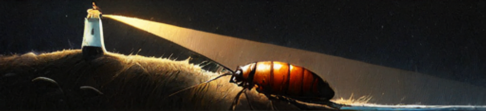

{width="5.5in"
height="1.261111111111111in"}

``` cdocs
this is a sample
hello world
printf()
```

# Draw ID

Test

{width="5.5in"
height="2.9364402887139107in"}

# Other stuff - like some probe stuff

open telemetry

{width="5.5in"
height="4.125in"}

uprobes

{width="5.5in" height="4.125in"}
