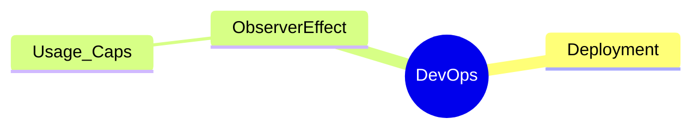

# DynamicTelemetry Persona : DEVOPS Persona

DynamicTelemetry personas are intended as an organizational aid to group
capabilities and usability of common usage scenarios. Browsing between scenarios
 is recommended, for the personas are intended only as an aid.

## Introduction

The DEVOPS Persona in DynamicTelemetry:

1. Scales virtual assets, like containers and VM's - firsthand
1. Understands how databases, alerting, and bug tracking systems are
interconnected
1. Knows when to reset virtual assets, and when to debug
1. Is well versed and comfortable with the differences between security and
privacy.  Knows how to protect users.

## Notes (To Be Deleted)

