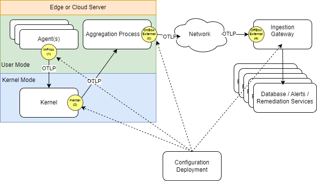

# Offbox Processor Coming Soon

This processor has a unique characteristic of being off-box and separate from
the machine being monitored. This is likely the least risky location to start
the migration of dynamic telemetry. It acts as a filter or data shaper. Because
it simply morphs telemetry after being produced, the machine producing it is
unaware of its presence.

For example, this is a good location for initial security or privacy scrubbing.
Tokens would be emitted from the machine but dropped prior to being ingested
into a database.
