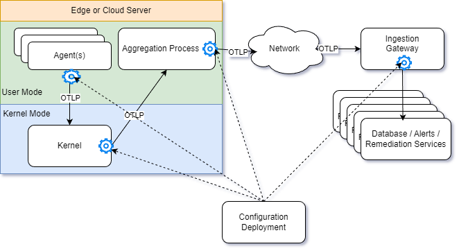

# OnBox Observer: Coming Soon

The processor runs in user mode on the machine being observed, but it is not in
the kernel. This is the final protocol conversion between the kernel's telemetry
system and the remote processor. In OpenTelemetry, the OLTP protocol is
utilized; however, gRPC or other protocols may also be used.
