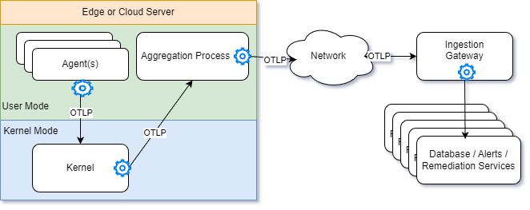

# Proessor Installation Overview : COMING SOON

In short, there are four locations that Can accept one of the three different dynamic telemetry processors.

1. [In process](./Architecture.Components.Observer.InProcess.document.md)

1. [In kernel](./Architecture.Components.Observer.Kernel.document.md)

1. In [aggregator or collector](./Architecture.Components.Observer.External.OnBox.document.md)

1. [Off box](./Architecture.Components.Observer.External.OffBox.document.md)

