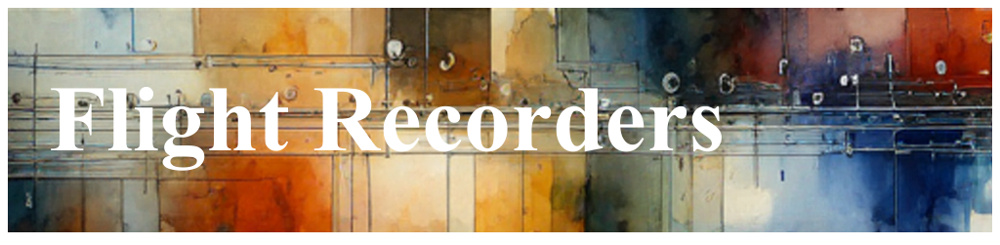

# Flight Recorder Overview

A Flight Recorder is an alternative and compliment to standard
[Streaming](./PositionPaper.FileAndStreaming.document.md) Observability.

The key differentiator between standard streaming telemetry, and a Flight
Recorder is that a Flight Recorder will only egress the Observability when
instructed by an [Action](./Architecture.Action.Explanation.document.md).

File-based telemetry collects data in a locally stored format, resembling the
way an airplane's black box safeguards flight parameters.

Many modern systems rely heavily on streaming telemetry for near real-time
monitoring. This approach fulfills observability needs by enabling on-the-fly
analysis and rapid response. Continuous data egress also makes it simpler to
spot trends or anomalies as they emerge.

Flight Recorder telemetry, on the other hand, stores higher volume logging for
post-event examination. Similar in concept to safeguarded flight data recorders
or fire safes, this method is especially valuable for incident reconstruction.
By preserving a higher fidelity of the past, Flight Recorders help 'fill in the
blanks' when gaps exist in standard streaming telemetry.

## What is a Flight Recorder?

Technically, a Flight Recorder comprises a ring buffer with fixed capacity,
typically residing in memory or (maybe) on disk, such that the data continually
overwrites older data with newer entries. This design is naturally lossy, yet it
captures essential insights about system events and states in near real time.

What is contained in a Flight Recorder, is simply redirected standard Logging -
this be from any [Probe](./Architecture.Probes.Overview.document.md) technology
that emits into OpenTelemetry.

Think of a Flight Recorder as just routed Observability, that goes nowhere,
unless asked. If you imagine
[the pipe analogy](./PositionPaper.TelemetryUmbilical.document.md) in the
Umbilical document, a Flight Recorder is just a cut Observability pipe, that is
redirected into a circular buffer, instead of streamed directly to a a backend.

## Special Characteristics of a Flight Recorder

In Dynamic Telemetry, one one machine, there can be hundreds - if not thousands
\- of Flight Recorders. Some are as small as a log record or two, others may
contain megabytes of Logs, collected over days.

The most special characteristic of a Flight Recorder, is that each can be
uniquely identified by a dedicated tag or name. This allows for quick
recognition among multiple data sources and ensures streamlined retrieval when
logs need to be collected by an Action.

This on-demand egress is a core feature, enabling data extraction whenever
deeper investigation is necessary. By preserving a snapshot of the overwritten
data, the Flight Recorder helps diagnose issues by making past telemetry
accessible for post-mortem analysis.

## How to collect a Flight Recorder

A Flight Recorder augments standard streaming telemetry by capturing data from
multiple probes, such as OpenTelemetry logging, ETW (Windows), user_events, or
syslog into a circular buffer. Logs remain local unless triggered to leave the
machine, delivering deeper insights through real-time and localized data
analysis.

By storing high-verbosity traces locally, a Flight Recorder retains critical
details for post-event analysis. Logs remain accessible when needed, even if
they might not be retained long-term.

This solution can provide both performance benefits and cost savings. To learn
more, refer to the position papers on
[scarcity](./PositionPaper.ScarcityAndHumans.md) and
[triggered flight recorders](./PositionPaper.TriggeredFlightRecorder.document.md).

The basic steps to collect a Flight Recorder are to know through some mechanism
its identifier and then to use a triggering action to collect it.

Steps Involved in Collecting a Flight Recorder

1. Route high volume Logging to a Flight Recorder
2. Note its Identifier
3. Use the Flight Recorder egress action, to collect the Flight Recorder

## Trace 'Horizons'

Flight Recorders often collect high volume logs that remain local until a
triggering event prompts upload. This approach introduces different trace
horizons. One horizon might capture logs leading to a process crash or other
diagnostic event. Because these logs can be high in volume, ring buffers
overwrite older data frequently. This arrangement is commonly referred to as a
"short-horizon" Flight Recorder.

In contrast, some logging applies only to specific failures that may take
minutes or days to occur. Examples include Bluetooth sessions on a client
operating system, long-running transactions, or writing data to a slow medium
like tape. These scenarios require maintaining a flight recorder over an
extended period, ensuring that all pertinent logs remain accessible when needed.

These lower volume but long duration Flight Recorders are known as long-horizon
Flight Recorders. They are designed to capture and retain logs over extended
periods, ensuring that all relevant data is available for analysis when needed.

## Interesting Applications of Flight Recorders

Flight Recorders are an extremely interesting and fun concept. As you gain
proficiency in using them, you'll find applications everywhere.

Blur some of this author's favorite uses.

### Information leading into a process crash



### Memory Leak Tracking



## References

1. [File and Streaming](./PositionPaper.FileAndStreaming.document.md)

1. [Telemetry Umbilical](./PositionPaper.TelemetryUmbilical.document.md)

1. [Scarcity and Humans](./PositionPaper.ScarcityAndHumans.md)

1. [triggered flight recorders](./PositionPaper.TriggeredFlightRecorder.document.md).
