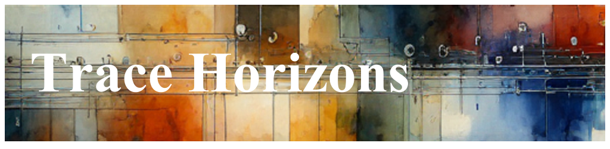

# Understanding Trace Horizons

The concept of a trace horizon is straightforward. It refers to the amount of
time that can typically be stored in a circular buffer.

When a Flight Recorder is discussed, it is often described by its trace length,
which is the duration of time it covers. For example, you might say, *"Every time
a process crashes, we collect a 5-minute Flight Recorder leading up to the
crash."*

Your Trace Horizon, in this case, **is 5 minutes**.

Achieving an exact 5-minute trace horizon is more of an ideal than a reality. In
practice, the trace length will vary, and it requires continuous refinement and
iteration over time. Your team will need to develop conventions and processes to
manage and adjusting the trace horizon effectively over time.

The variable involved in your Horizon are:

1. The **amount of memory** provided to the Flight Recorder.
1. The **verbosity of logs** that have been sampled in by the filter.

Imagine a simple example where your software is running smoothly, and the Flight
Recorder is operating nominally. **No Flight Recorders are emitted - they cost
nothing in your backends/databases, and almost nothing on the machines being
monitored.** Suddenly, however, your code goes into a failure mode where the
logging for errors dramatically spikes up.

In this example, you've configured your filter to collect these logs into a
fixed memory Flight Recorder where they remain until an issue triggers an
Action. These logs are then stored in the Flight Recorder, where they stay until
either the buffer wraps or the Action emits the entire log into your
observability backends.

Should an Action trigger the egressing Flight Recorder. It'll go into your
standard observability backends where your developers can enjoy a higher
fidelity amount of logging than when operating in an nominal case.

It's not uncommon for teams to discover that they either have too much
information and would prefer a longer trace horizon, or they would like to
shuffle the logging that is stored. Typically, after some analysis, they'll want
to reconfigure the filter that serves this Flight Recorder.

Their options will include:

1. [Filtering](./Scenarios.EventSuppression.document.md) out the chatty logs
1. Converting the chatty logs into a [Metric](./Scenarios.ConvertLogsToMetrics.document.md)
1. Increasing the memory dedicated to the Flight Recorder

The key takeaway for this section is that the trace horizon is a critical aspect
of Dynamic Telemetry.

1. Dev + Ops teams specify their desired trace horizon along with their memory
   budgets.
1. This is enforced with the Dynamic Telemetry filter that routes log messages
   into the Flight Recorder.
1. It is expected that the trace horizon will be within a reasonable tolerance
   of the desired value. However, predicting which log messages will be chatty,
   especially in a failure condition, can be challenging.
