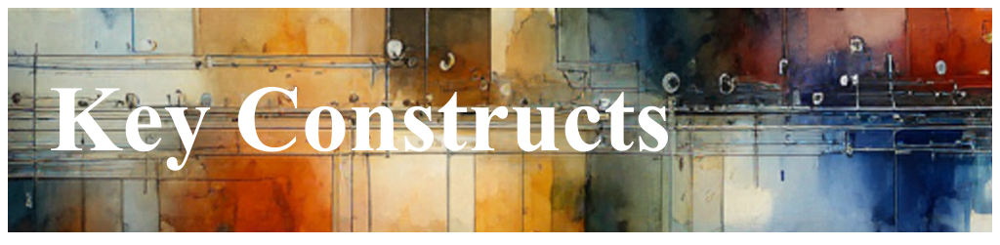

# Survey: Filters, Flight Recorders, and Actions

If there is any aspect of Dynamic Telemetry that requires thorough
understanding, it is the critical distinction between static telemetry and
Dynamic Telemetry. At its core, this distinction represents the transition from
hard-coded, static assets to more versatile and reconfigurable Dynamic
Telemetry. This distinction forms the foundation of Dynamic Telemetry.

The four Constructs of Dynamic Telemetry are

1. a [Probe](./Architecture.Probes.Overview.document.md)
1. a [Filter](./Architecture.Components.FiltersRoutersAndAdapters.document.md)
1. a [Flight Recorder](./Architecture.FlightRecorder.Overview.document.md)
1. a [Action](./Architecture.Action.Explanation.document.md)

## What is a Probe{.unlisted .unnumbered}

A Dynamic Telemetry Probe is a lightweight mechanism that emits events (logs)
within a running system. A Probe is usually specific to the operating system and
native to that environment. For example, it could be the Event Tracing for
Windows (ETW) system within Windows, user events within Linux syslog, or even
OpenTelemetry on cross-platforms.

### Examples of Dynamic Probes{.unlisted .unnumbered}

Dynamic Probes can take various forms depending on the system and requirements.
Examples include uprobes or kprobes, which are used in Linux for tracing
user-space and kernel-space events, respectively. Software breakpoints are
another type of probe, often used in debugging to halt program execution at a
specific point. Hardware breakpoints, on the other hand, leverage the
processor's debugging facilities to monitor memory access or code execution.
Additionally, eBPF (extended Berkeley Packet Filter) programs provide a powerful
and flexible way to insert dynamic probes into the Linux kernel, enabling
detailed performance monitoring and security analysis.

In essence, a Probe is a logging event emitter. In a static telemetry system, it
represents the legacy-based approach where logging events are hard-coded into
the application. This means that any changes to what is logged or how it is
logged require modifications to the source code and a subsequent redeployment of
the application. Dynamic Telemetry Probes by contrast offer a more flexible and
adaptable solution. They allow for the insertion, modification, and removal of
logging events without altering the application code. This dynamic nature enables
real-time adjustments to telemetry data collection, facilitating more responsive
and efficient monitoring and diagnostics.

## What is a Filter/Router{.unlisted .unnumbered}

A filter is a Dynamic Telemetry construct used to filter and route logging that
is already inside an OpenTelemetry pipeline.

Imagine an OpenTelemetry pipeline as a pipe of water. Cutting the pipe and
adding a filter or diverter would allow you to control the flow. A fully
blocking filter could be considered a valve. The use of filters and routers
allows the dynamic shaping and routing of telemetry - much like valves and
filters in a water system.

## What is a Flight Recorder{.unlisted .unnumbered}

A Flight Recorder is essentially a ring buffer of logs with a unique identifier
or name. It acts as a designated collector of routed logging data. In its
simplest form, a Flight Recorder might be a memory buffer. In other
implementations, it could be a file on disk.

The two key characteristics of a Flight Recorder are:

1. that it is uniquely identifiable
1. that it contains logs

## What is an Action{.unlisted .unnumbered}

An Action is an architectural construct that performs tasks based on the logging
data it observes passing through a pipeline.

Consider a log message indicating a failure in some business logic, such as a
multi-step transaction failure. If a listener of this log message decides to
take action, for example, by collecting a memory dump or starting a CPU sample,
this actor would be referred to as an Action.

Actions can manipulate constructs like Filters, Probes, and Flight Recorders.
For example, by configuring a Filter to detect memory management logs, you can
direct those logs to a specialized Flight Recorder Action designed for
diagnosing memory leaks. This Flight Recorder can capture snapshots of heap
usage or detailed allocation patterns whenever the filter's trigger conditions
are met. This enables quick identification of problematic regions within the
application's memory footprint without continuously running resource-intensive
diagnostics.
