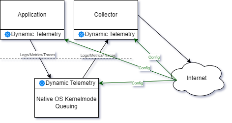

# DynamicTelemetry Philosophy

DynamicTelemetry is an articulation of the emobodiemnt of a suite of Observablity tools, designed to manage, control, and
reshape telemetry in
[Production](./PositionPaper.DefiningProduction.document.md) systems.

Essentially, DynamicTelemetry is a set of enforced conventions that
enable various sophisticated diagnostic systems to work in harmony. It
ensures compatibility with user privacy and security needs.
Simultaneously, DynamicTelemetry provides businesses with the ability to
adjust their Observability based on necessity. This allows resources to
be allocated when needed and restricts telemetry when it's not required.

This document aims to delve into the philosophy of DynamicTelemetry,
exploring the intricate balance between complex realities. While this
document serves as a comprehensive spiritual guide, some readers might
find it beneficial to start with the usage
[scenarios](./Scenarios.Overview.document.md) to get a better
understanding of the system.

## DynamicTelemetry, in a nutshell

[Demos](./Demos.1_IntroDemo.md) are a great way to go hands on with
DynamicTelemetry, but before diving in to the complex realities
DynamicTelemetry seeks to resolve, it's important to have a general
undertqnding of usage.

Image yourself as a
[DEVELOPER](./Persona_Developer.document.md). You're focused
on the latest business needs from your [PROJECTMANAGER](./Persona_ProjectManager.document.md). You're worried
about solving business problems, keeping costs in check,

## OnBox Architecture


## Tenants

``` cdocs
{{ Include("./PositionPaper.DynamicTelemetryTenants.document.md",
    "start-TenantOverview",
    "end-TenantOverview")
}}
```