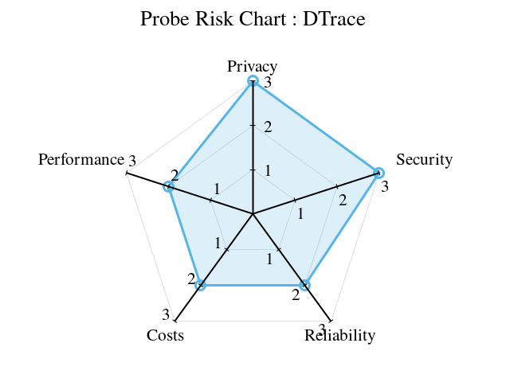
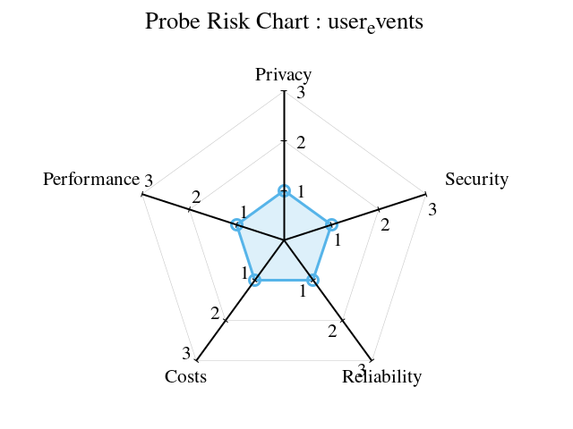

# Probe Explanation

In DynamicTelemetry a "[PROBE](./Definitions.document.md#PROBE)" is the base case
abstraction for all means of measure. PROBES extract information from the
working system, and convert them into a schematized OpenTelemetry Log, Metric,
or Trace.

## Introduction
In the realm of system monitoring and data analysis, DynamicTelemetry introduces a unique and efficient component known as a “probe”. A probe, in the context of DynamicTelemetry, is a dynamic element that is capable of producing small quantities of valuable data. This data, often derived from various operations and processes within the system, serves as a rich source of information for analysis and troubleshooting.

The defining characteristic of these probes is their non-disruptive nature. They are designed to operate seamlessly within the system without causing any disruption to the machine’s performance or quality. This means that while these probes are actively extracting and producing data, they do not cause any noticeable slowdown or alteration in the system’s operations.

This non-intrusive and efficient data production makes probes an integral part of DynamicTelemetry, enabling it to monitor system performance, detect anomalies, and provide valuable insights for system optimization. The use of probes underscores DynamicTelemetry’s commitment to maintaining system integrity while providing a robust and comprehensive monitoring solution.

## Course Types of Probes

### Static probes
 are those that are always active and continuously monitor the system. They are less risky and more performance expensive. Examples include ETW on Windows and syslog, LTG user events, and perf on Linux1.

### Dynamic probes
 on the other hand, are those that can be enabled or disabled as needed. They are more flexible and can provide rich information quickly when enabled. However, they can be more risky as they might modify the system, like E BPF1.

DynamicTelemetry allows you to dynamically and quickly enable a probe to extract information and egress it into your standard existing open telemetry workflows. This can be particularly useful in a production system where a probe might be disabled1.

However, it’s important to note that using probes, especially dynamic ones, could potentially impact system performance. Therefore, DynamicTelemetry has safeguards to restrict this impact1.

## Examples of Probes
Probes can be found in various systems, each tailored to the specific environment and requirements of that system. They are designed to seamlessly integrate with the system’s operations, providing valuable data without causing any disruption.

On Windows, one such example of a probe is Event Tracing for Windows (ETW). ETW is a powerful tracing tool provided by the Windows operating system. It allows developers to both log real-time binary events and instrument their applications and the system to capture events. These events can then be used to analyze the performance and diagnose issues, making ETW a valuable probe in the Windows environment.

In the Linux ecosystem, there are several examples of probes. Syslog, for instance, is a standard for message logging. It allows for the separation of the software that generates messages, the system that stores them, and the software that reports and analyzes them. This makes Syslog a versatile and valuable probe in a Linux environment.

Another example in Linux is LTG (Linux Trace Toolkit) user events. These are a type of probe that provides a mechanism to trace and monitor user-space applications and correlate activities with kernel-space events. This correlation provides a comprehensive view of the system’s behavior, making LTG user events a valuable probe.

Perf is yet another example of a probe in Linux. It is a powerful tool that can be used to count events and monitor certain aspects of software and hardware, providing valuable data for performance analysis.

These examples illustrate the diversity and adaptability of probes across different systems. Despite their differences, all probes share the common goal of providing valuable, non-disruptive data for system monitoring and analysis.

## Use of Probes in DynamicTelemetry
In the DynamicTelemetry system, probes serve as dynamic data sources that can be enabled or disabled as needed. This flexibility is crucial in a production environment where unnecessary data collection can lead to performance degradation.

When a probe is disabled, it remains dormant within the system, not contributing any data or consuming any resources. However, the true power of probes comes to light when they are enabled. With DynamicTelemetry, users can dynamically enable a probe when they need to extract specific information from the system. This process is quick and efficient, allowing users to gather valuable data on-demand without any significant impact on system performance.

Once a probe is enabled, it begins to emit data that is then egressed into the open telemetry workflows. For instance, a user could turn on a U probe to monitor the return value for a particular function. This data is then sent to open telemetry for further processing and analysis.

The role of DynamicTelemetry in this process is to facilitate the dynamic enabling of probes and the initial extraction of data. Once the data is emitted to open telemetry, DynamicTelemetry’s role ends. The data is then handled by the standard egressing mechanisms of open telemetry, which could involve various processes such as aggregation, counting, or direct emission as a log.

This dynamic and on-demand use of probes makes DynamicTelemetry a powerful tool for real-time system monitoring and data extraction. It allows users to gather rich, valuable data when they need it, providing insights that can help optimize system performance and troubleshoot issues.

## Performance Impact and Safeguards of Probes in DynamicTelemetry
The use of probes in DynamicTelemetry can potentially impact system performance. This is primarily due to the frequent emission of logs, which could consume system resources and affect performance. However, DynamicTelemetry is designed with this consideration in mind and includes several safeguards to mitigate this impact.

One of the key principles of DynamicTelemetry is to ensure that the use of probes does not compromise system performance. To achieve this, DynamicTelemetry has implemented mechanisms to restrict the frequency and volume of log emissions. These mechanisms are designed to balance the need for detailed data with the necessity of maintaining optimal system performance.

For instance, DynamicTelemetry may limit the number of logs that a probe can emit within a certain timeframe. This prevents a probe from overwhelming the system with excessive data. Additionally, DynamicTelemetry may also implement safeguards at the probe level, such as limiting the amount of data that a probe can extract or the resources that it can consume.

These safeguards ensure that the use of probes in DynamicTelemetry remains efficient and non-disruptive. They allow DynamicTelemetry to provide detailed and valuable data without compromising the performance of the system. This makes DynamicTelemetry a reliable tool for system monitoring and data analysis, capable of providing rich insights while maintaining system integrity and performance.

ToDo:

* Risk vs. Perf axis
* Discuss operations that can occur to a probe
* Contrast a probe from a breakpoint
* Talk about how Logs/Traces can be used as probes
* Link to Observer Effect
* Link to Risk Levels

## Probe Characteristics

1. Intentionally READ-ONLY; this is a 'hard and fast' rule in OpenTelemetry that
 may box out some very powerful opportunities.

1. Intentionally INEXPENSIVE to performance

## READONLY

## INEXPENSIVE

## Probe Risk

Probes inherently pose risks to [Production](./PositionPaper.DefiningProduction.document.md)
systems. These risks manifest in various forms. DynamicTelemetry aims to mitigate
these risks across five different dimensions: Privacy, Security, Reliability,
Cost, and Performance.

This document provides a framework for understanding these risks and the
mitigation techniques used, as discussed in
the [Observer Effect](./PositionPaper.ObserverEffect.document.md).

## Probe Risk mitigation's

### Privacy

Mitigation:

1. READ-ONLY: intentionally a PROBE does not alter the functionally of a system

1. [Configuration Deployment](./PositionPaper.ConfigurationDeployment.document.md);
PROBE configurations are always deployed with the same oversight as production code.

1. [Privacy](./PositionPaper.TelemetryUmbilical.document.md)

### Security

### Reliability

### Cost

### Performance

## Probe Values

* Local Suppression
* Remote Suppression

| Value          | Remote Mitigations | Local Mitigations |
| --             | --               | --                  |
|  1 (low risk)  | :smiley:         | :smiley:            |
|  2 (med risk)  |                  | :smiley:            |
|  3 (high risk) |                  |                     |

## Linux Probe Types (and their risks)

### OpenTelemetry

### DTrace

### eBPF

### ptrace

### uprobes

### user_events

## Windows Probe Types (and their risks)

### ETW

### eBPF

