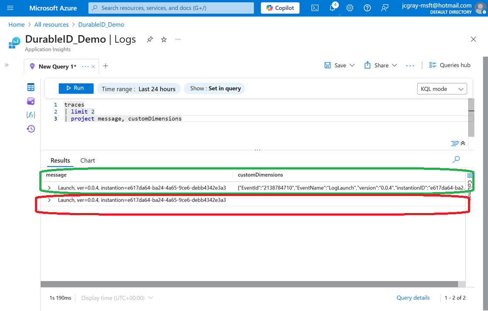

# Demo 0 - Durable ID's Explanation

## Using DurableID in OpenTelemetry, to locate the source of the the expense

This demonstration will showcase and contrast two logging messages in
OpenTelemetry. One will use a Durable Identifier, and the other will not. It's
expected that not all software using OpenTelemetry will utilize a durable
identifier, even though, in Dynamic Telemetry, the use of the DurableID is
considered a best practice. A durable identifier functions like a GPS or homing
beacon, mapping any row of telemetry to a specific line of code.

In Microsoft .net platform, a durable identifier is created automatically at
compile time for OpenTelemetry user using ILogger - when the author of the
software follows best practices.

### Contrasting C# that makes use of Durable ID's, with C# that does not

Let's examine code that makes use of a durable identifier versus one that
doesn't. We'll inspect both in the Application Insights Log database, to spot
the difference.

### Seeing the DurableID in Azures Application Insights

Lets start with the recommended way to log in .NET; using ILogger, with a
compiler generated Durable ID.

#### Recommended Way to Log

```cdocs_include
{{ CSharp_Include("../Samples/DurableIds/Pages/Index.cshtml.cs",
    "// StartExample:DurableId",
    "// EndExample:DurableId")
}}
```

#### Not Recommended Way to Log

```cdocs_include
{{ CSharp_Include("../Samples/DurableIds/Pages/Index.cshtml.cs",
    "// StartExample:NoDurableId",
    "// EndExample:NoDurableId")
}}
```

#### Full Example Code

```cdocs_include
{{ CSharp_Include("../Samples/DurableIds/Pages/Index.cshtml.cs",
    "// StartExample:ContrastDurableID",
    "// EndExample:ContrastDurableID")
}}
```

#### Spotting the difference in your database

While both of these logging methods result in the same printf() ('flatted') log,
the one with the Durable ID offers many extra goodies.

Please recall the source snippets above;  when these two lines of code manifest
in our database, they look as follows.



Upon examining each of these rows in the telemetry data, you will notice that
one contains an entry in the custom definitions while the other does not.

This customDimension column is generated by the compiler, and includes a string based
EventName as well as a numerical EventId.

You can see an expanded version of these fields below.


#### Trying to reason over lots of Logs

Scenarios that require performant study and aggregation of clusters of Logs,
really struggle with 'flattened' logs.  This is discussed more in the
[Position Paper on Durable
ID's](./PositionPaper.DurableIds_StructuredPayloads.document.md), but in short,
due to the addition of a GUID, each row of telemetry is different from another.

You can see this quickly, with a quick dcount (distinct count) of each message.


Notice in this screenshot, that the number of distinct messages is similar to
the number of absolute messages - without a Durable Identifier, spotting the
differences can be difficult.  This in turn complicates cost reductions, as well
as any number of the Dynamic Telemetry scenarios.

## Use Azure Monitor and KQL language to locate an expensive OpenTelemetry log

Lets go back to the original code;  and use the compiler generated Durable ID to
quickly count the ILogger log, that followed recommended guidance.

```cdocs_include
{{ CSharp_Include("../Samples/DurableIds/Pages/Index.cshtml.cs",
    "// START : LoopRandomGUID",
    "// END : LoopRandomGUID")
}}
```

```cdocs_include
{{ CSharp_Include("../Samples/DurableIds/Pages/Index.cshtml.cs",
    "// START_DEFINE : LogRandomGuid",
    "// END_DEFINE : LogRandomGuid")
}}
```

This time, instead of trying to deduplicate with the message (where the GUID all
bug guarantees each row is unique), we will deduplicate with the
extracted EventName field.

{width="5.5in"
height="4.3991393263342085in"}

You'll notice "LogRandomGuid" quickly stands out, with a tidy dcount(),  whereas
the other similar log is still unclear.

With the event name in hand, we can quickly do all sorts of quick study and
aggregation across our logs.  With a little dreaming, it's easy to appreciate
the value of the investment. What was once multiple pages of rows has now been
streamlined into only five rows.
