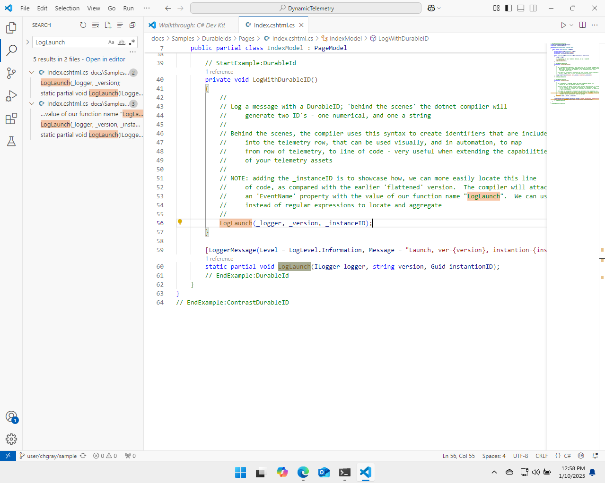

# Cost Reduction Demo : Inline KQL Filtering

Dynamic Telemetry can be used for many applications and in this one we will use
it to reduce the cost of our services locating and dropping a highly verbose log
message very quickly.

## Demo Overview

In short this demo will

- Use Azure Monitor and KQL language to locate an unexpectedly expensive Open
  Telemetry log.

- Utilize the DurableID feature on OpenTelemetry, to locate the line of code
  responsible for the expense.

- Instruct Dynamic Telemetry to convert the Log into a Metric

- Choose one of the five Dynamic Telemetry locations to apply our KQL filter.

- Deploy the conversion, and measure the impact

## Demo Video

## Use Azure Monitor and KQL language to locate an expensive Open Telemetry log

By using the query below in Application Insights, we can utilize the Durable
Identifier found in our logs to pinpoint specific log messages or identify any
log messages that are particularly resource-intensive. This is an example, so
none of these logs are notably expensive.

However, in a real production environment with millions or billions of rows, you
will observe more significant instances.

{width="5.5in"
height="4.4303149606299215in"}

With the event name in hand (LogLaunch), one can appreciate the value of having
a DurableIDentifier. What was once multiple pages of rows has now been
streamlined into only five rows. Some of these event names are generated by the
network infrastructure itself, while the second and fourth ones are produced by
our demonstration program.

It is noticeable that the counts of the empty row are slightly higher compared
to the log launch row. This discrepancy arises because not every log row
corresponds to a log launch. This observation further underscores the point; in
this instance, nine messages have been aggregated into a single entry. In a
production system, one can expect this number to be significantly higher, which
would subsequently increase potential confusion exponentially.

## Utilize the DurableID, to locate the line of code responsible for the expense

It should be immediately apparent that using a DurableIDentifier instead of a
regular expression is significantly faster and more cost-effective than using
flattened strings.

As shown in the figure above, nearly 3500 messages originate from a single line
of code, accounting for approximately 50% of all logging activities.

Although this is a constructed example, it is not uncommon for around 8 lines of
code to be responsible for about 50% of log-based telemetry.

We can efficiently search our source code for this function by utilizing our
source editor or various tools similar to grep.

Consider the utility of static analysis tools that process your DLLs. These
tools can easily identify mistakes like leaked secrets, such as IP addresses,
MAC addresses, or user identifiers.

{width="5.0in"
height="3.9993055555555554in"}

The tool will efficiently identify the specific line of code, almost as if it
were equipped with a GPS. In future versions of .NET and Dynamic Telemetry, one
could envision a tool capable of processing debug symbols and utilizing
reflection on the DLLs to pinpoint the exact build and line of code. This
subject is discussed in greater detail in the relevant sections on
DurableIDentifiers.

## Instruct Dynamic Telemetry to drop the chatty Log

Now we will use Dynamic Telemetry to focus on and address this event.

This topic is discussed in much greater detail in other sections that provide
extensive content necessary for a full understanding. In brief, Dynamic
Telemetry offers several architectural locations where modifications can be made
to the data being produced.

While avoiding full expansion in this demonstration, it should be noted that
detailed explanations are available in other sections. In summary, we can now
process telemetry in real-time based on various risk profiles.

1. In the process of the emitting agent

1. In the kernel of the emitting agent

1. In an aggregation / upload service

1. At the point of ingestion, off the box.

{width="5.0in"
height="3.9993055555555554in"}

## Instruct Dynamic Telemetry to convert the Log into a Metric

Now we will use Dynamic Telemetry to focus on and address this event.

This topic is discussed in much greater detail in other sections that provide
extensive content necessary for a full understanding. In brief, Dynamic
Telemetry offers several architectural locations where modifications can be made
to the data being produced.

While avoiding full expansion in this demonstration, it should be noted that
detailed explanations are available in other sections. In summary, we can now
process telemetry in real-time based on various risk profiles.

1. In the process of the emitting agent

1. In the kernel of the emitting agent

1. In an aggregation / upload service

1. At the point of ingestion, off the box.

{width="5.0in"
height="3.9993055555555554in"}

## Choose one of the five Dynamic Telemetry locations to apply our KQL filter

For this simple example of dropping a chatty event, we'll use an in-process
emission to avoid context switches and maintain performance due to the minimal
check required. The necessary risks and benefits are detailed in other sections
of this document and deserve further exploration.

As demonstrated in the above screenshot, we have developed a concise KQL filter
that will be integrated into the process of the emitting agent. This filter is
designed to be "clipped or attached" to the line of code responsible for
emission in a highly efficient manner that does not impact overall or local
system performance.

In fact, with a robust implementation, there may be net CPU performance
improvements due to the reduction in time and processing power needed to encode
various payloads and transfer them between user mode, kernel mode, and back to
user mode before network transmission.

These efficiency gains occur even before reaching our backend databases, which
was the initial focus. As a result, the log message will not be omitted,
ingested, indexed, or stored.

## Deploy the conversion, and measure the impact

Deployment into your environment is flexible, as Dynamic Telemetry offers
various configuration methods. Depending on your needs, you may choose different
techniques and deployment speeds.

For instance, a large cloud provider might prefer a gradual deployment of
Dynamic Telemetry configurations. In contrast, small or medium-sized companies
might find benefits in deploying them instantaneously.

This decision is largely personal, and the necessary information and knowledge
to make an informed choice are detailed further in other sections of this
documentation.

For our purposes, we will deploy this rapidly for demonstration purposes.

## Recap
