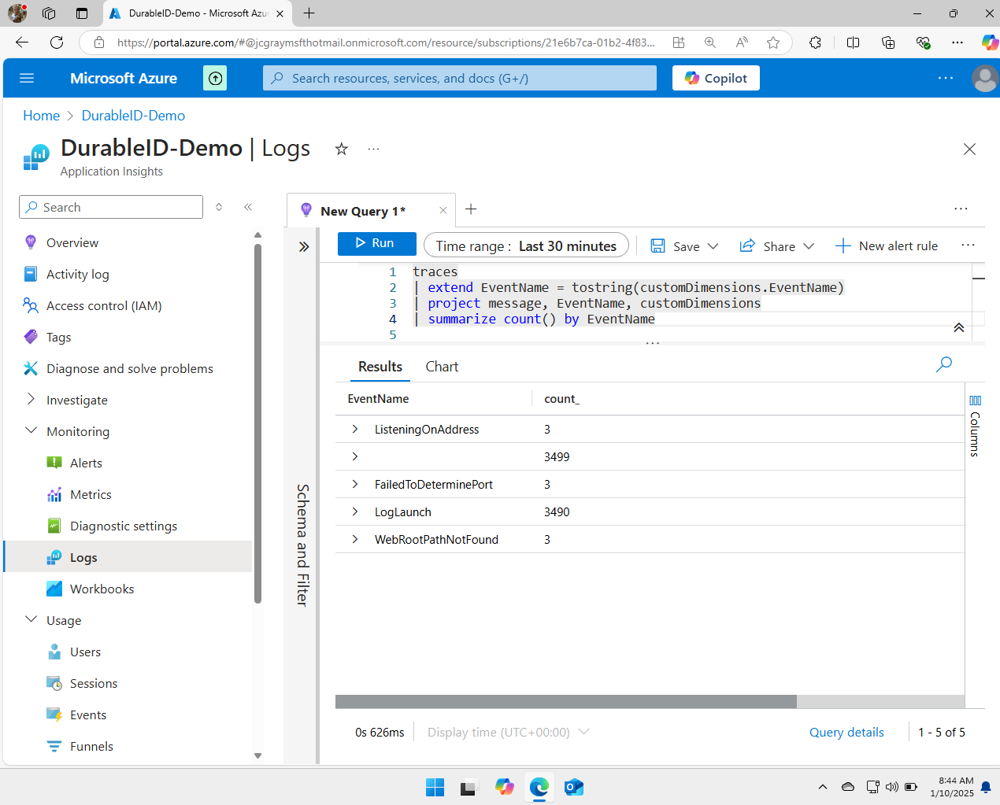

# Cost Reduction Demo : Inline KQL Filtering

Dynamic telemetry can be used for many applications and in this one we
will use it to reduce the cost of our services locating and dropping a
highly verbose log message very quickly.

## Demo Overview

In short this demo will

-   Use Azure Monitor and KQL language to locate an unexpectedly
    expensive Open Telemetry log.

-   Utilize the DurableID feature on OpenTelemetry, to locate the line
    of code responsible for the expense.

-   Instruct Dynamic Telemetry to convert the Log into a Metric

-   Choose one of the five dynamic telemetry locations to apply our KQL
    filter.

-   Deploy the conversion, and measure the impact

## Use Azure Monitor and KQL language to locate an unexpectedly expensive Open Telemetry log

{width="5.5in"
height="4.4303149606299215in"}

With the event name in hand, one can appreciate the value of having a
durable identifier. What was once multiple pages of rows has now been
streamlined into only five rows. Some of these event names are generated
by the network infrastructure itself, while the second and fourth ones
are produced by our demonstration program.

It is noticeable that the counts of the empty row are slightly higher
compared to the log launch row. This discrepancy arises because not
every log row corresponds to a log launch. This observation further
underscores the point; in this instance, nine messages have been
aggregated into a single entry. In a production system, one can expect
this number to be significantly higher, which would subsequently
increase potential confusion exponentially.

## Instruct Dynamic Telemetry to convert the Log into a Metric\*\*

##Choose one of the five dynamic telemetry locations to apply our KQL
filter.

## Deploy the conversion, and measure the impact

## Recap
