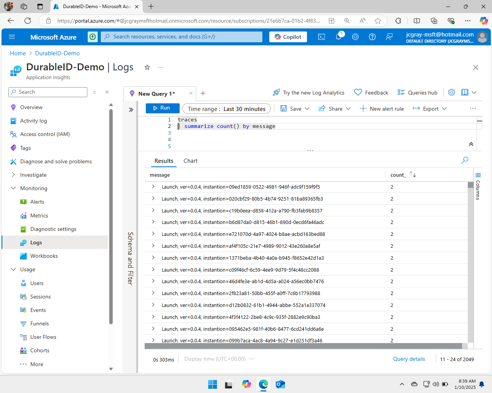

# Cost Reduction Demo : Inline KQL Filtering

Dynamic telemetry can be used for many applications and in this one we
will use it to reduce the cost of our services locating and dropping a
highly verbose log message very quickly.

## Demo Overview

In short this demo will

* Use Azure Monitor and KQL language to locate an unexpectedly
expensive Open Telemetry log.

* Utilize the DurableID feature on OpenTelemetry, to locate the line of
code responsible for the expense.

* Instruct Dynamic Telemetry to convert the Log into a Metric

* Choose one of the five dynamic telemetry locations to apply our KQL
filter.

* Deploy the conversion, and measure the impact

## Utilize the DurableID feature on OpenTelemetry, to locate the line of code responsible for the expense.

Not all software using open telemetry will utilize a durable identifier,
though it is considered best practice. A durable identifier functions
like a GPS or homing beacon, mapping any row of telemetry to a specific
line of code.

In microsoft.net platform the durable identifier is created
automatically at compile time for open telemetry assuming the author of
the software follows best practices.

### Contrasting C# that makes use of Durable ID's, with C# that does not**

Let\'s examine code that correctly uses a durable identifier versus one
that doesn\'t. We'll inspect both in Application Insights, so we can
spot the difference.

It\'s important to understand that Dynamic Telemetry functions with and
without a DurableID, however the experience without is less enjoyable
and less efficient. Following best practices is highly encouraged.

### Seeing the DurableID in Azures Application Insights

#### Recommended Way to Log

```cdocs_include
{{ CSharp_Include("../Samples/DurableIds/Pages/Index.cshtml.cs",
    "// StartExample:DurableId",
    "// EndExample:DurableId")
}}
```

#### Not Recommended Way to Log

```cdocs_include
{{ CSharp_Include("../Samples/DurableIds/Pages/Index.cshtml.cs",
    "// StartExample:NoDurableId",
    "// EndExample:NoDurableId")
}}
```

#### Full Example Code
```cdocs_include
{{ CSharp_Include("../Samples/DurableIds/Pages/Index.cshtml.cs",
    "// StartExample:ContrastDurableID",
    "// EndExample:ContrastDurableID")
}}
```

#### Spotting the difference in your database


#### Seeing the Confusion, lack of capability


##### Using the EventName to locate the line of code


##### Aggregating based on the EventName




## Use Azure Monitor and KQL language to locate an unexpectedly expensive Open Telemetry log


## Instruct Dynamic Telemetry to convert the Log into a Metric**

##Choose one of the five dynamic telemetry locations to apply our KQL
filter.

## Deploy the conversion, and measure the impact

## Recap
