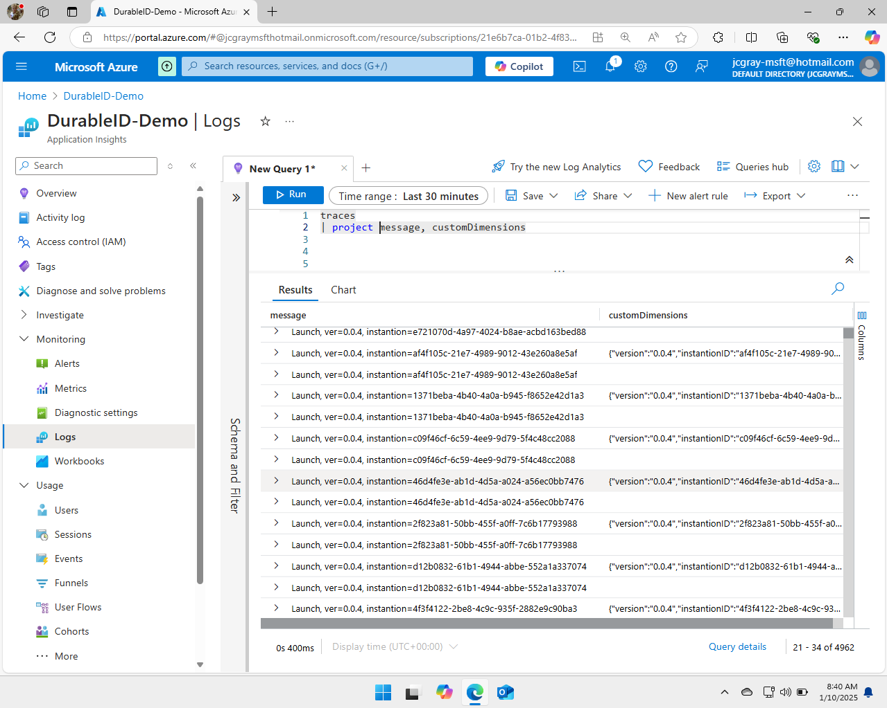
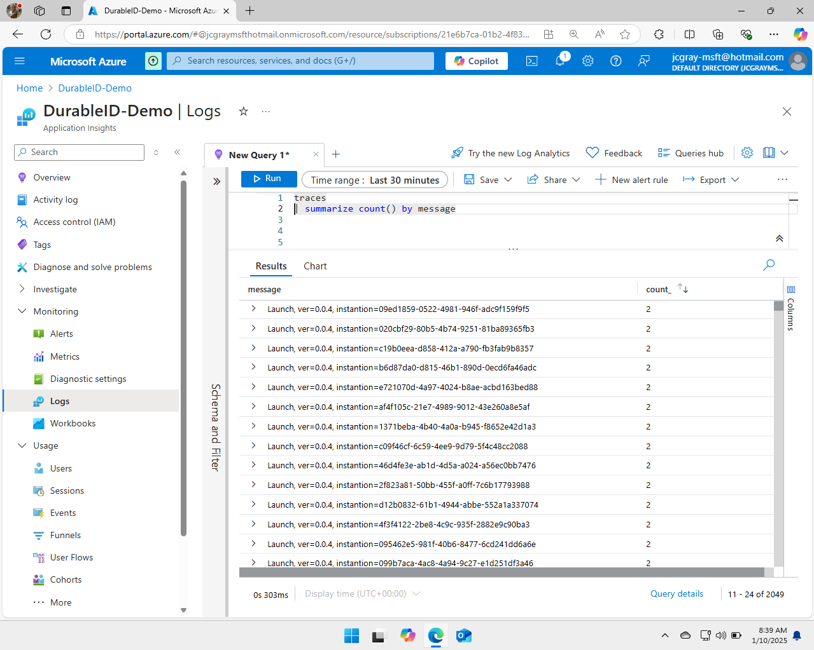
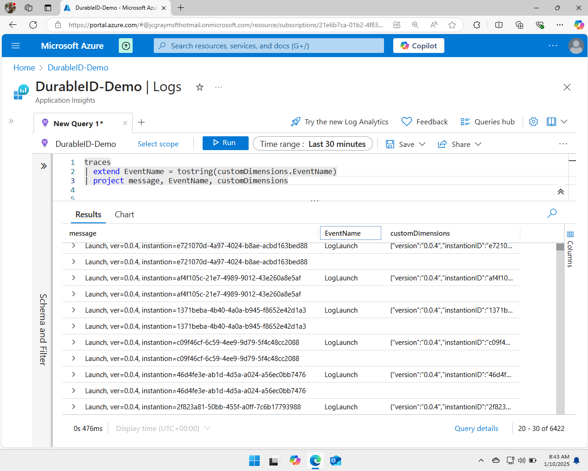

# Cost Reduction Demo : Inline KQL Filtering

Dynamic telemetry can be used for many applications and in this one we
will use it to reduce the cost of our services locating and dropping a
highly verbose log message very quickly.

## Demo Overview

In short this demo will

-   Use Azure Monitor and KQL language to locate an unexpectedly
    expensive Open Telemetry log.

-   Utilize the DurableID feature on OpenTelemetry, to locate the line
    of code responsible for the expense.

-   Instruct Dynamic Telemetry to convert the Log into a Metric

-   Choose one of the five dynamic telemetry locations to apply our KQL
    filter.

-   Deploy the conversion, and measure the impact

## Utilize the DurableID feature on OpenTelemetry, to locate the line of code responsible for the expense.

Not all software using open telemetry will utilize a durable identifier,
though it is considered best practice. A durable identifier functions
like a GPS or homing beacon, mapping any row of telemetry to a specific
line of code.

In microsoft.net platform the durable identifier is created
automatically at compile time for open telemetry assuming the author of
the software follows best practices.

### Contrasting C# that makes use of Durable ID's, with C# that does not\*\*

Let\'s examine code that makes use a durable identifier versus one that
doesn\'t. We'll inspect both in Application Insights, so we can spot the
difference.

It\'s important to understand that Dynamic Telemetry functions with and
without a DurableID, however the experience without is less enjoyable
and less efficient. Following best practices is highly encouraged.

### Seeing the DurableID in Azures Application Insights

#### Recommended Way to Log

``` cdocs_include
{{ CSharp_Include("../Samples/DurableIds/Pages/Index.cshtml.cs",
    "// StartExample:DurableId",
    "// EndExample:DurableId")
}}
```

#### Not Recommended Way to Log

``` cdocs_include
{{ CSharp_Include("../Samples/DurableIds/Pages/Index.cshtml.cs",
    "// StartExample:NoDurableId",
    "// EndExample:NoDurableId")
}}
```

#### Full Example Code

``` cdocs_include
{{ CSharp_Include("../Samples/DurableIds/Pages/Index.cshtml.cs",
    "// StartExample:ContrastDurableID",
    "// EndExample:ContrastDurableID")
}}
```

#### Spotting the difference in your database

The most obvious way to see the differences between this these two
different methods of emitting telemetry is by looking and inspecting
your database.

Without this awareness, the suggested logging method might seem overly
complex, as it requires extra effort and log record creation.

{width="5.5in"
height="4.3991393263342085in"}

Upon examining each of these rows in the telemetry data, you will notice
that one contains an entry in the custom definitions while the other
does not. The row without a custom definition originates from a direct
call to log information, resulting in the omission of these critical
fields.

At first glance, it may appear that incorporating a durable identifier
incurs higher storage and compute costs; this is initially accurate and
holds true in this example. However, as you optimize your database, you
may end up entirely omitting the message column.

Subsequentl what sceney, you can expand the custom dimensions values
into their distinct type-specific saved columns, which are indexed and
offer high performance.

This optimization step is what really will bring dramatic cost savings,
an increased diagnostic capabilities, to the table.

#### Seeing the Confusion, lack of capability

{width="5.5in"
height="4.3991393263342085in"}

Let\'s explore some of these savings by examining where our costs are
going. If we aggregate the rows of telemetry using a basic summary based
on the message string, you\'ll observe that each row has two counts.

One of the counts is derived from log information without a durable
identifier, while the other comes from logging with the durable
identifier. This results in a row count of two for each log entry, which
is an intentional aspect of the demo\'s design.

It\'s hard to get a clear picture of your telemetry without a durable
identifier. At best, you\'ll use regular expressions to turn a telemetry
row into something identifiable and traceable.

##### Using the EventName to locate the line of code

{width="5.5in"
height="4.406029090113736in"}

Let\'s utilize our durable identifier by creating a separate event name
column. Costs may rise due to the custom dimensions column.

To reduce costs, consider dropping the message column and extracting the
event name for indexing during ingestion. This leverages the strengths
of a relational database and indexing efficiently.

##### Aggregating based on the EventName

## Use Azure Monitor and KQL language to locate an unexpectedly expensive Open Telemetry log

{width="5.5in"
height="4.4303149606299215in"}

With the event name in hand, one can appreciate the value of having a
durable identifier. What was once multiple pages of rows has now been
streamlined into only five rows. Some of these event names are generated
by the network infrastructure itself, while the second and fourth ones
are produced by our demonstration program.

It is noticeable that the counts of the empty row are slightly higher
compared to the log launch row. This discrepancy arises because not
every log row corresponds to a log launch. This observation further
underscores the point; in this instance, nine messages have been
aggregated into a single entry. In a production system, one can expect
this number to be significantly higher, which would subsequently
increase potential confusion exponentially.

## Instruct Dynamic Telemetry to convert the Log into a Metric\*\*

##Choose one of the five dynamic telemetry locations to apply our KQL
filter.

## Deploy the conversion, and measure the impact

## Recap
