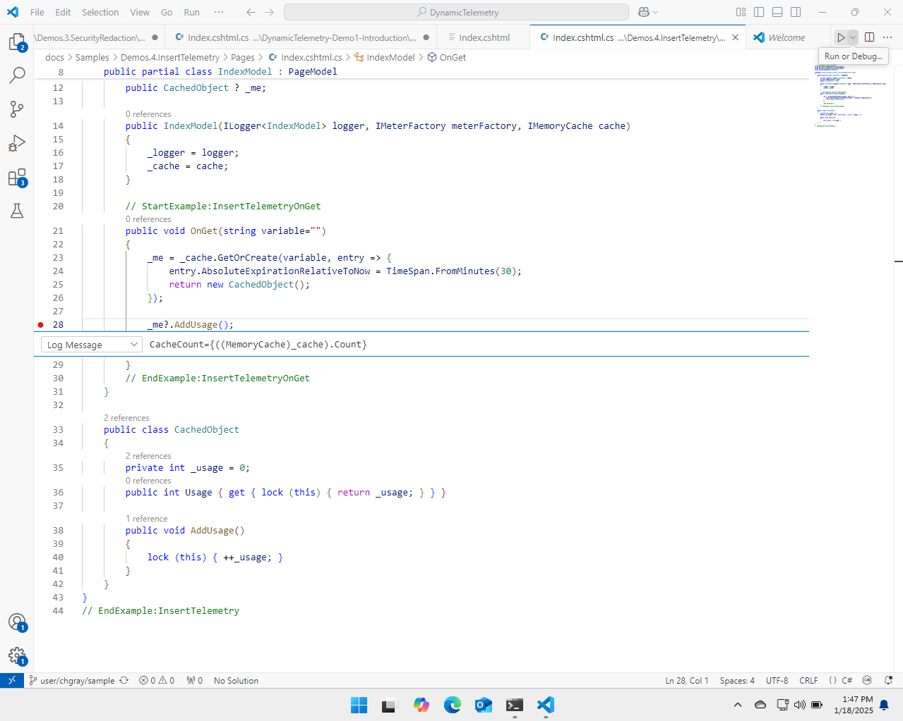

# Diagnostic Demo: Dynamically Adding a Row of Telemetry

In a live production system, diagnosing and debugging using only existing
telemetry can be challenging. Sometimes, there is a strong need to know the
value in memory or the stack of a caller.

These data gaps can leave developers guessing about the behavior of their code.
Simply knowing the value of a variable or two can provide significant insights
into the problem, reducing the time to diagnose dramatically.

In this example, we will use Dynamic Telemetry
[Probes](./Architecture.Probes.Overview.document.md) to insert a specialized
breakpoint into our code. This will allow us to dynamically extract small
amounts of memory and insert it into our existing OpenTelemetry pipelines.

## Demo Overview and Video


In short this demo will:

1. Use a Dynamic / Breakpoint Probe to dynamically insert a row of telemetry to
   emit the contents of a variable into our standard OpenTelemetry pipelines.
1. Deploy this Dynamic Telemetry probe to a small number of machines that we
   expect to be impacted.
1. Connect to Application Insights and View / Graph / Alert this value.

## Dynamically insert a row of telemetry to emit the contents of a variable

For this demo, we will make use of the
[Dynamic / Breakpoint Probe](./Architecture.Probe.Breakpoint.document.md)
concept in Dynamic Telemetry, Our
[Action](./Architecture.Actions.Overview.document.md). Will not be a
complicated action such as collecting a memory dump, starting a CPU sample, or
toggling on or off diagnostic logs, even though Each of these are a possibility.

For our application, we simply want to know the value of a memory variable when
our probe is hit.

To achieve a good developer workflow. We will use the Visual Studio Code source
editor To locate the line of code where we wish to Extract some memory.

Please quickly scan over the following piece of code. You don't need to
understand all of it, just get a general idea of the page model. The key
observation is that in the `OnGet` method, we receive a variable from the user
and use that variable as a key in the cache, which is kept 30 minutes.

Every time `OnGet` is called, a counter on the cached object will be incremented
via the `AddUsage` function.

```cdocs_include
{{ CSharp_Include("../Samples/Demos.4.InsertTelemetry/Pages/Index.cshtml.cs",
    "// StartExample:InsertTelemetry",
    "// EndExample:InsertTelemetry")
}}
```

Please recall this sample is just that, a sample. To illustrate the use case,
let's assume that as our system scales, we notice performance issues. Our
development team suspects that the cache is getting full, causing paging issues
on our drives. They are considering investigating the 30-minute time span, as it
might be too long.

To better understand the problem, the developers would like to know how many
items are in the cache while under load. One of the developers got the idea to
use Dynamic Telemetry to simply emit the cache size as a telemetry variable and
then graph it using their standard OpenTelemetry pipelines.

```cdocs_include
{{ CSharp_Include("../Samples/Demos.4.InsertTelemetry/Pages/Index.cshtml.cs",
    "// StartExample:InsertTelemetryOnGet",
    "// EndExample:InsertTelemetryOnGet")
}}
```

To achieve this. We will open the Visual Studio Code. Editor and locate the
piece of code where we would like to insert our Probe.

{width="5.5in"
height="4.3991393263342085in"}

We simply right-click and select "Add Dynamic Telemetry Memory Probe."

Similar to standard Visual Studio conditional breakpoints, we can set emission
criteria for a variable in a way that does not stop the execution pointer. This
method is both fast and safe.

{width="5.5in"
height="4.3991393263342085in"}

When this breakpoint is hit, the memory will be extracted and inserted into the
standard and previously deployed OpenTelemetry pipelines. You can then view this
data from your standard database.

## Deploy this probe to a small number of machines that we expect to be impacted

Deployment into your environment is flexible, as Dynamic Telemetry offers
various configuration methods. Depending on your needs, you may choose different
techniques and deployment speeds.

For instance, a large cloud provider might prefer a gradual deployment of
Dynamic Telemetry configurations. In contrast, small or medium-sized companies
might find benefits in deploying them instantaneously.

This decision is largely personal, and the necessary information and knowledge
to make an informed choice are detailed further in other sections of this
documentation.

For our purposes, we will deploy this rapidly for demonstration purposes.

## Connect to Application Insights and View / Graph / Alert this value

Because the Dynamic / Breakpoint Probe conforms to the Dynamic Telemetry
specification, the collected memory will be emitted into a standard
OpenTelemetry logging message that includes the desired contents.

This is this is an interesting feature because within seconds of being deployed,
telemetry is already being emitted.

Rapid turnaround creates an environment where developers can quickly add
telemetry, probe, cast nets, monitor, and learn without worrying about impacting
their customers.

In our example, we're trying to determine why or how the cache values are
growing so quickly, if they are indeed growing.

We use dynamic telemetry to deploy a scenario where we extract the number of
items in the memory cache and emit it as a log message.

As you can see in our query below, we plot the number of log welcome messages as
one line and the maximum count as the other line.

```cdocs_include
{{ CSharp_Include("../Samples/Demos.4.InsertTelemetry/Pages/Index.cshtml.cs",
    "// StartExample:KQL_Monitor",
    "// EndExample:KQL_Monitor")
}}
```

We then wait to see if the cache value increases due to some anomaly.

{width="5.5in"
height="4.3991393263342085in"}

Sure enough. After a little bit of waiting. We see a case where the cash values
grow. (As indicated by the red line) Whereas the number of incoming requests
remains roughly steady. (As indicated by the blue line)

{width="5.5in"
height="4.3991393263342085in"}

Even more interesting is the observation that the line grows very rapidly over a
span of a few minutes and then flattens out before shrinking back down.
Measuring the time delta across this indicates that the cache values grow
linearly for a bit of time, hold for about 30 minutes, and then drop as they
grew.

A review of the code makes it obvious what is occurring.

```cdocs_include
{{ CSharp_Include("../Samples/Demos.4.InsertTelemetry/Pages/Index.cshtml.cs",
    "// StartExample:InsertTelemetryOnGet",
    "// EndExample:InsertTelemetryOnGet")
}}
```

In this example for some reason. The calling clients are changing the variable
coming in. In a way that each. Request is seemingly unique. They do this for a.
Period. Short period of time and then it stops.

Because this is a silly example, there's no reason that this occurring. However,
the graphs make it obvious that that is what is occurring. The 30 minutes that
we see is because the cash value has an absolute expiration time of 30 minutes.
