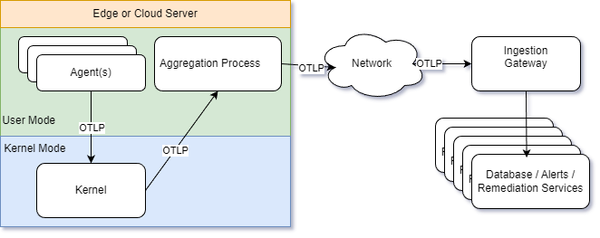
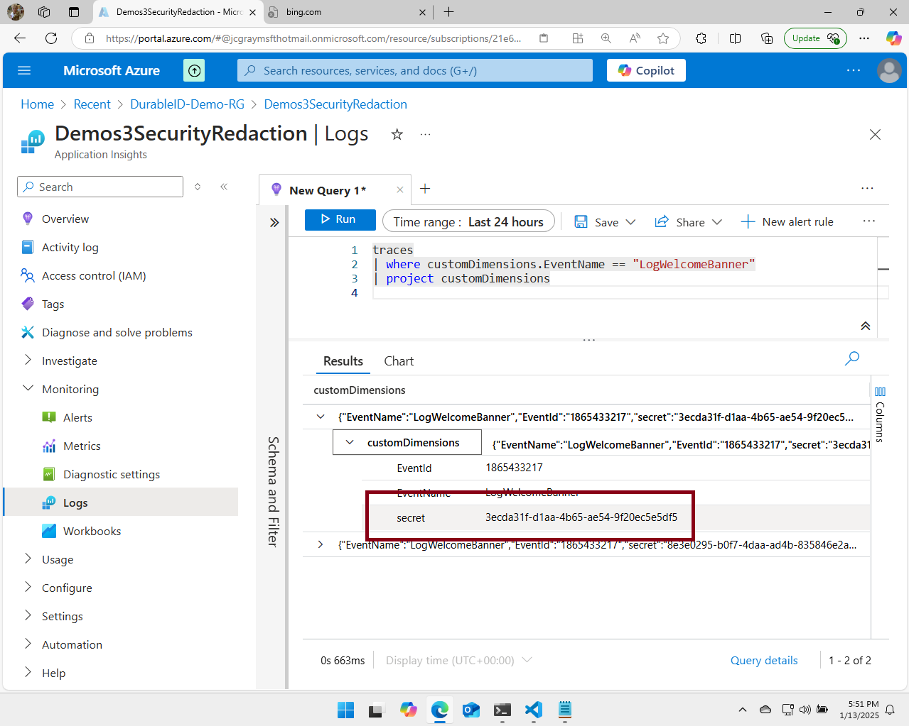
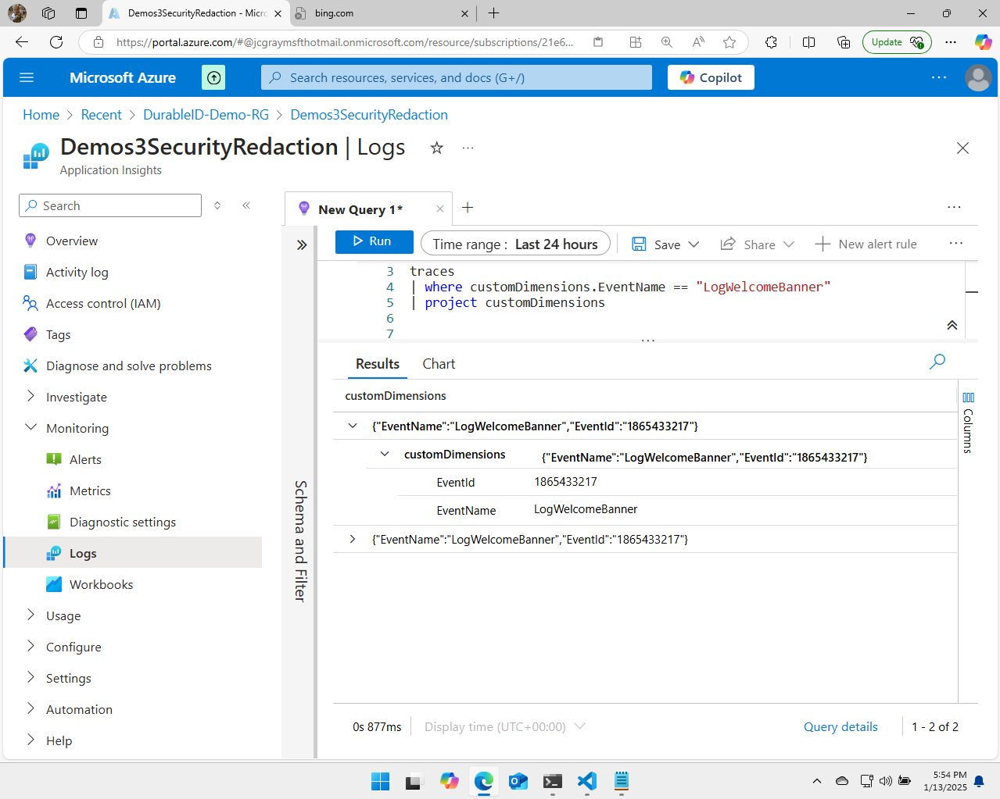

# High Level Overview Demo, of Dynamic Telemetry

Welcome to this demonstration of Dynamic Telemetry. In this demo, we will
quickly take a broad survey of Dynamic Telemetry, highlighting key usage
scenarios and important architectural points.

## Overview of Dynamic Telemetry

Dynamic Telemetry is an open-source diagnostic tool that complements
OpenTelemetry. It aims to make debugging live production systems as easy and
enjoyable as debugging a single application locally. Our goal is to allow you to
diagnose and explore live production systems while minimizing risks to
reliability, performance, or customer privacy.

## Value Proposition

Dynamic Telemetry builds on top of OpenTelemetry to provide advanced features
for debugging, performance measurement, privacy and security hardening, as well
as cost reduction. This overview will give you a broad understanding, with
deeper dives into each of these scenarios available in later sections of this
documentation.

## Demonstration

In this demonstration, we're going to how case the broad architecture points
found in added Dynamic Telemetry. We'll build on the standard OpenTelemetry
Kubernetes sample without modifying or recompiling any code. This showcases the
seamless integration and powerful capabilities of Dynamic Telemetry.

It is assumed that you already have an OpenTelemetry pipeline in place that
houses your Logs, Metrics, and Traces in your preferred database. While our
samples will utilize Azure technology, you are welcome to use any technology
stack that suits your needs.

## Key Architectural Concept

Dynamic Telemetry, in short, is a dynamically controlled diagnostic control,
that is inserted into one of four architectural locations in your existing Open
Telemetry pipeline.

Each insertion point, also called a Processor, accepts configuration from a
remote configuration deployment server, and intercepts all OpenTelemetry logs
metrics and traces that are being emitted and passed through that architectural
point in the below diagram.

### Standard OpenTelmetry Architectural Overview

In the diagram below, you will observe a typical OpenTelemetry architecture,
where multiple agents transmit their telemetry data through the kernel of their
host operating system.

In some OpenTelemetry architectures, the aggregation process and kernel are
omitted in favor of direct ingestion from an agent. These architectures are
usually employed in small to medium-sized installations. Although they function
similarly, these variations are not the focus of this demonstration.

{width="5.5in"
height="2.185044838145232in"}

### Survey of a Dynamic Telemetry Processor

A
[Dynamic Telemetry Processor](./Architecture.Components.Processor.Overview.document.md)
is a software component that is dynamically configured and operates within the
standard OpenTelemetry OLTP pipeline. This processor is detailed further in the
processor section, but essentially, it is a software module that monitors all
events passing through it and allows one of the Dynamic Telemetry personas to
modify the telemetry being transmitted.

Subject to implementation a Dynamic Telemetry processor is likely to be fitting
into one of several categories

1. A
   [Query Language](./Architecture.Components.Processor.QueryLanguage.document.md)
   (SQL, KQL, etc)

1. A
   [Programming Environment or Language](./Architecture.Components.Processor.Language.md)
   (eBPF, .NET, Python, Rust, etc)

1. A textually defined
   [State Machine, or State Model](./Architecture.Components.Processor.StateMachine.document.md)

### Installation Points for Dynamic Telemetry Processors

The diagram below shows the installation of Dynamic Telemetry processors in four
different architectural locations.

1. In
   [process of the emitting agent](./Architecture.Components.Observer.InProcess.document.md)

1. In the
   [kernel of the Operation System hosting the agent](./Architecture.Components.Observer.Kernel.document.md)

1. In the
   [aggregation process](./Architecture.Components.Observer.External.OnBox.document.md)
   that is about to emit to the ingestion gateway

1. At the
   [point of ingestion](./Architecture.Components.Observer.External.OffBox.document.md)

The Processor section of this document expands upon these four different
insertion points more thoroughly, but in short, each installation point have
capability, cost, and benefit tradeoffs.

{width="5.5in"
height="2.185044838145232in"}

### Capabilities of Dynamic Telemetry

With a basic understanding of where architecturally Dynamic Telemetry can be
inserted into the OpenTelemetry pipeline it's important to understand the types
of operations that Dynamic Telemetry can offer.

1. Dropping Logs or Metrics

1. Adding Logs or Metrics

1. Converting Logs into Metrics

1. Dropping fields in Logs

1. Adding fields to Logs

1. Maintaining state / awareness

### Simple Sample Using KQL Filter to Drop an Entire Log Message

Consider a scenario where you have a software agent that is emitting logs. For
various reasons, you may decide that some of the logs are unnecessary or
unwanted. Instead of rebuilding, retesting, and redeploying your code, you would
prefer to have a pause button for these logs.

You might want to pause the logs during high traffic times to save costs, or
only enable logging when diagnosing the software. Another option could be
pausing the logs to prevent the spread of accidentally logged sensitive
information.

To achieve this goal, we utilize the KQL
[Query Language](./Architecture.Components.Processor.QueryLanguage.document.md)
Processor -- and quickly deploy the below KQL to the most appropriate of the
four Processors.

```cdocs_include
{{ CSharp_Include("../Samples/Demos.3.SecurityRedaction/Pages/Index.cshtml.cs",
    "// StartKQL:FilterWholeLog",
    "// EndKQL:FilterWholeLog")
}}
```

The above KQL could be inserted at any one of the processors described in the
previous section and when the log message is being emitted at that appropriate
processing location the log would be simply paused (dropped) as long as the
dynamically deployed configuration was applied.

### Simple Sample Using KQL Filter dropping fields in a Log

A potentially more interesting application would be the removal of a particular
field within a log

In this scenario for some reason a particular field was included and then later
after deployment was decided that field was unnecessary or unwanted this can
happen for several reasons ranging from costs to security, database performance,
and privacy it could also be simply a case of just wanting to be more tidy
anesthetics

Consider the example below from our demonstration on content redaction. This
simulation code unintentionally emits a secret, which we need to remove before
it is ingested into our databases.

In this simulated workflow, we wish to remove the secret before it's egressed
from the web agent.

```cdocs_include
{{ CSharp_Include("../Samples/Demos.3.SecurityRedaction/Pages/Index.cshtml.cs",
    "// StartFunction:MistakenEmission",
    "// EndFunction:MistakenEmission")
}}
```

```cdocs_include
{{ CSharp_Include("../Samples/Demos.3.SecurityRedaction/Pages/Index.cshtml.cs",
    "// StartKQL:FilterWholeLog",
    "// EndKQL:FilterWholeLog")
}}
```

To achieve this goal, we utilize the KQL
[Query Language](./Architecture.Components.Processor.QueryLanguage.document.md)
Processor -- and quickly deploy the below KQL to the most appropriate of the
four Processors.

Without Dynamic Telemetry a rebuild retest and redeploy be required but with
Dynamic Telemetry the simple configuration below can be dynamically transmitted
to any of the four described processors at which point any log named
"*LogWelcomeBanner*" have it's "secret" field redacted.

```cdocs_include
{{ CSharp_Include("../Samples/Demos.3.SecurityRedaction/Pages/Index.cshtml.cs",
    "// StartKQL:FilterField",
    "// EndKQL:FilterField")
}}
```

#### Database view of the Log that contains a secret

As demonstrated below, by utilizing Application Insights and KQL, it is evident
that the secret in our code has been transmitted to the backend databases.

{width="5.5in"
height="4.3991393263342085in"}

Because this secret was "accidentally" emitted; we wish to remove just the
field.

#### Database view of the Log, after field redaction

As you can see in the below Screenshot, immediately after the KQL filter was
deployed, just the 'secret' field is redacted.

```cdocs_include
{{ CSharp_Include("../Samples/Demos.3.SecurityRedaction/Pages/Index.cshtml.cs",
    "// StartKQL:FilterField",
    "// EndKQL:FilterField")
}}
```

{width="5.5in"
height="4.3991393263342085in"}

### Including Configuration Deployment Service

Since every deployment environment has unique characteristics and tolerances for
risk, Dynamic Telemetry leverages the inherent code and configuration of the
infrastructure's deployment systems. Further details on this topic are provided
in subsequent sections. It is essential to consider configuration deployment as
the most efficient mechanism that ensures responsible usage within the hosted
environment.

{width="5.5in"
height="3.0075524934383204in"}
