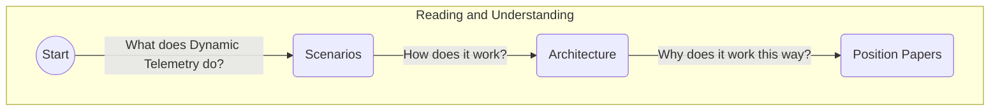

# HowTo : Reading and understanding Dynamic Telemetry Documentation

[Dynamic Telemetry](https://microsoft.github.io/DynamicTelemetry) is a set of
documents that offers a glimpse into the next 10 years of Observability and
Telemetry, as well as providing a historical ledger of important design
decisions made in the past 20 years.

Dynamic Telemetry aims to be an educational on-ramp for newcomers in the field,
while also serving as a guiding beacon for experts looking to align their
efforts with a broader perspective.

Dynamic Telemetry does not describe a single implementation of Observability, or
Telemetry. It is not intended to focus exclusively on one operating system, one
cloud
provider, or one database.

Think of Dynamic Telemetry as a map, into the future and past of Observability.

For the most part, Dynamic Telemetry will focus on Open Source technologies.
However, as you read the Dynamic Telemetry documentation, you'll notice a
mixture of Open Source and closed source software offerings. Dynamic Telemetry
does not take a principled position on either; both are considered valuable.

The Dynamic Telemetry documentation is organized. Into three layers.

1. **Scenarios**; mapping user utility into software architecture
1. **Architecture**; showcasing the software "big boxes" and data flows
1. **Position papers**; articulating dilemmas and choices that had to be
   balanced along the way

If you're a user of the Dynamic Telemetry systems, [feel free to read the
Scenarios and the
Architecture](https://microsoft.github.io/DynamicTelemetry/docs), then stop.
This will help cement your understanding of usage, as well as motivation.

If you are ***designing software*** or frustrated by an aspect of dynamic
Telemetry, don't stop reading at the architecture! Keep reading into position
papers. As you read, you may encounter disagreeable positions. This is okay!
***Reasonable people may disagree in the position papers.***

***Please surface your questions and disagreements!***, through our
[CONTRIBUTING](https://github.com/microsoft/DynamicTelemetry/blob/main/CONTRIBUTING.md)documentation.

[To begin your journey;  visit https://microsoft.github.io/DynamicTelemetry](https://microsoft.github.io/DynamicTelemetry)
