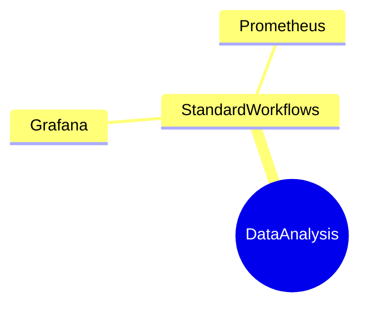

# DynamicTelemetry Persona : DEVOPS Persona

DynamicTelemetry personas are intended as an organizational aid to group
capabilities and usability of common usage scenarios. Browsing between scenarios
 is recommended, for the personas are intended only as an aid.

## Introduction

The DATA_ANALYST Persona in DynamicTelemetry:

1. Looks for patterns - has a background in math, AI, big data, statistics, etc
1. Apprecates (but doesn’t necessarily depend on) schematized data, with crisp
contracts
1. Is well versed and comfortable with the differences between security and
privacy. Knows how to protect users.

## Scenarios

1. [Bug Beacon](./PositionPaper.ClearFailuresViaSchema.document.md)
1. [A/B Feature Testing](./PositionPaper.ABTestingWithRichDiagnostics.document.md)
1. [Catagorized/Schematized Failures](./PositionPaper.ClearFailuresViaSchema.document.md)
1. [Triggered Flight Recorder](./PositionPaper.TriggeredFlightRecorder.document.md)

## Notes (To Be Deleted)

