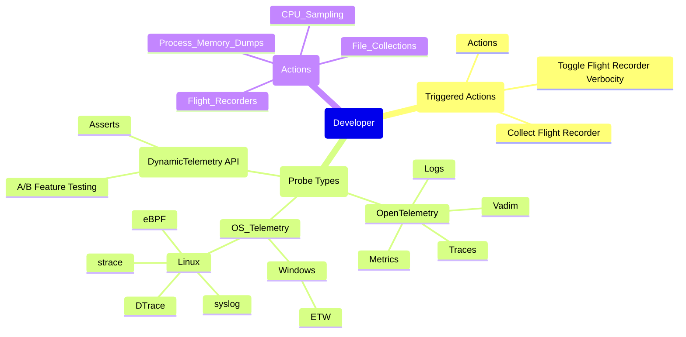

# DynamicTelemetry Persona : DEVELOPER Persona

DynamicTelemetry personas are intended as an organizational aid to group
capabilities and usability of common usage scenarios. Browsing between scenarios
 is recommended, for the personas are intended only as an aid.

## Introduction

The DEVELOPER Persona in DynamicTelemetry:

1. *Authors code*, firsthand
1. Understands *technical details* like data schemas, instruction pointers, and
can differentiate logs/traces from metrics.
1. Comfortable with *core operating system concepts*, like threads, heaps, and
stacks
1. Understands *symbolic debuggers*, code offsets, and symbols
1. Is well versed and comfortable with the differences between security and
privacy.  Knows how to protect users.

## Scenarios

1. [Bug Beacon](./PositionPaper.ClearFailuresViaSchema.document.md)
1. [A/B Feature Testing](./PositionPaper.ABTestingWithRichDiagnostics.document.md)
1. [Categorized/Schematized Failures](./PositionPaper.ClearFailuresViaSchema.document.md)
1. [Triggered Flight Recorder](./PositionPaper.TriggeredFlightRecorder.document.md)
1. [Triggered Memory Dump](./PositionPaper.TriggeredMemoryDump.document.md)
1. [Extracting Memory - dynamic probe insertion](./Scenarios.ExtractingMemoryWithUProbe.document.md)
1. [Memory Leaks](./Scenarios.MemoryLeak.document.md)

## Notes (To Be Deleted)

