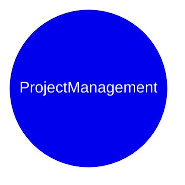

# DynamicTelemetry Persona : Project Managment

DynamicTelemetry personas are intended as an organizational aid to group
capabilities and usability of common usage scenarios. Browsing between scenarios
 is recommended, for the personas are intended only as an aid.

## Introduction

The PROJECT_MANAGER Persona in DynamicTelemetry:

1. Focuses on solving business problems - if technology meets the needs of users
1. Is concerned with costs
1. Is concerned about schedule, timelines
1. Is concerned about balancing quality, product applicability, and features
1. Balances mutiple environments
1. Is well versed and comfortablze with the differences between security and
privacy.  Knows how to protect users.

1. [Clear Failujres via Schemas](./PositionPaper.ClearFailuresViaSchema.document.md)
1. [Triggered Flight Recorder](./PositionPaper.TriggeredFlightRecorder.document.md)

## Scenarios

