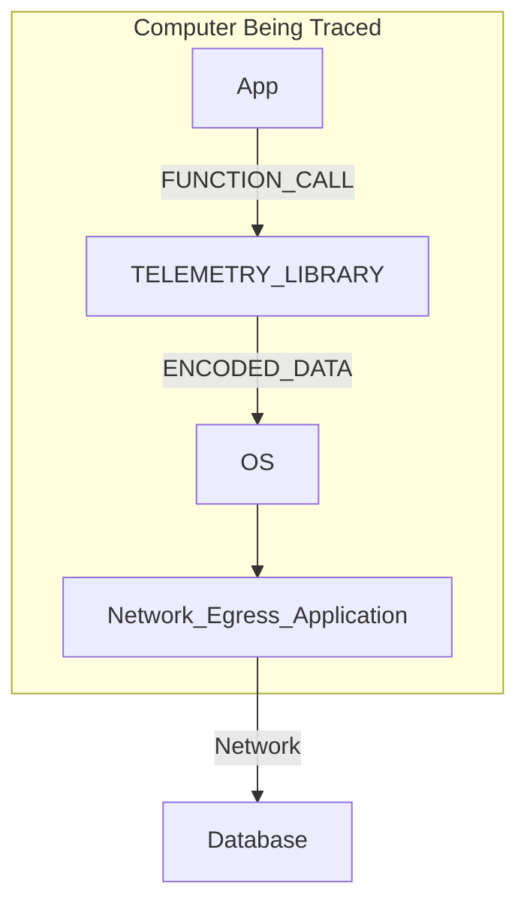

# Durable ID's and Structured Payloads

In Telemetry/Observably, we often have need to locate the exact file and line of
code that emitted a log message. We also often need to be able to decode the
event, in ways that allow for searching and locating for arguments passed into
that log event.

Applications are many, but include reducing financial costs, quicker time to
diagnosis by leveraging database tools and techniques, graphical tooling, visual
pivoting, sorting, and time ordering aggregations. More advanced applications,
that will be described later in this document, include "triggering" - where an
event being emitted can be used to trigger memory dumps, CPU sampling, or even
enable the production of more telemetry on command.

Triggering dramatically expands opportunities in "touchless" (non-interactive)
debugging. Triggers allow "traps" to be set for bugs, where the telemetry system
can lay in wait, watching for a bug to manifest - and when it does! ...the
TRIGGER can spring in action, capturing memory dumps, CPU call stack sampling,
or even can dial up extra telemetry collection.

The importance of DurableID's and Structured Payloads cannot be overstated -
projects running on millions or billions of machines, that do not make use of
API's equipped with DurableID's and Structured Payloads are almost a guaranteed
to be on the path to either struggle to be diagnosed, or will be migrating
within a few years to a new telemetry system. Of course, there are notable
exceptions with niche applications; LED's, buzzers, and oscilloscopes also still
serve their purpose, as do API's like syslog and printf.

The claim isn't that API's without structured payloads and durable ID's aren't
valuable; they are valuable - however in applications where one entity/company
is responsible for managing millions of machines, with potentially billions of
dollars in years telemetry expenses -the claim is these API's should be
procedurally banned for the reasons outlined in this document.

## Introduction : It's all about positively identifying the line of code

Lets start the introduction, by showing an event that contains both a DurableID
and Structured Payload. We will then outline why the ID and payload are both
important and valuable. In both examples, it's assumed there exists a means of
egressing the telemetry to a remote database



After the example, we will then outline why the Durable ID and Structured
Payload is both important and valuable.

### Whats 'success' looks like

1. EXAMPLE #1 (GOOD!)

```cdocs

LoggingWrite(
        g_Handle,
        "MemoryStatusUpdate",               <-- DurableID
        LoggingUInt32(value, "UpdateValue") <-- Structured Payload (U32/string)
        );
```

### EXAMPLE #2 (BAD!)

```cdocs

LoggingWrite("UPDATING VALUE: updating value to %d", value);

```

### Materially how do these differ?

In both these examples, the "UpdateValue" will be passed to the
"TELEMETRY_LIBRARY" using a "FUNCTION_CALL", the "TELEMETRY_LIBRARY" will then
encode the data using some means (discussed below), and then passed over the
network, to a database, for insertion into a table.

Before looking at the values in the database tables, imagine each of the
examples are encoded in a similarly the below; this is the "ENCODED_DATA"
boundary below - before being passed off to the Operating Systems telemetry
plumbing.

```cdocs
# EXAMPLE1: with DurableId/Structured Payload
[DurableID][UdateValue]                          <-- potentially compact

vs.

# EXAMPLE2 : without DurableID and Structured Payload
UPDATING VALUE: updating value to <value>      <-- not as compact
```

This difference is due to what we're calling "flattening" in this writeup. The
term is defined more below; but the gist is the dynamic portions of the log are
squished, by the TELEMETRY_LIBRARY into one string, before being passed into the
telemetry subsystem.

While both are equally useful for searching once entered into a database, the
first example will be easier to search and filter. For example, the search query
for "what hour of the day are updates of value > 10 most common?"

### What is "flattening"

Only EXAMPLE#2 is flattening the payload - at the FUNCTION_CALL boundary the
TELEMETRY_LIBRARY will be passed two items

1. "UPDATING VALUE: updating value to %d"
1. 10

Inside of TELEMETRY_LIBRARY, it'll then "flatten" these two values into one
string "UPDATING VALUE: updating value to 10"

From there, this string becomes the "ENCODED_DATA" passed into the Operating
System, heading to be ingested into a Database Table.

To start understanding why this is fatal to a TELEMETRY_LIBRARY, imagine the
code in EXAMPLE#2 code executing three times - emitting the following strings
into a database

| Time | Message | | --- | --- | | 12:01:00 | UPDATING VALUE: updating value to
10 | | 12:02:00 | UPDATING VALUE: updating value to 23 | | 12:03:00 | UPDATING
VALUE: updating value to 56 |

...this doesn't seem horrible right? ...we'll expand why this is bad in a future
section.

But for now, to provide contrast - imagine the code in EXAMPLE#1 also executing
three times - emitting the telemetry into a database

| Time | DurableID | UpdateValue | | --- | --- | --- | | 12:01:00 |
MemoryStatusUpdate | 10 | | 12:02:00 | MemoryStatusUpdate | 23 | | 12:03:00 |
MemoryStatusUpdate | 56 |

Notice how each of these entries coming from EXAMPLE#1 more organized? While the
data from EXAMPLE#2 potentially can be searched in an emergency, doing this
programmatically will be so difficult it needs to be considered impossible in
all situations but real problem.

The root problem is that **in the database, we cannot positively identify the
file+line of code that produced the telemetry**

## Applications

Applications for DurableID's and Structured Payloads are not hard to discover,
once one starts looking.

The "trick" to finding applications is the realization that any event can be
searched, located, and aggregated quickly.

The searching doesn't have to be limited to a database - it's common to have on
box searching (aka "TRIGGERING"). Triggering only means having a program
(usually one that is configured dynamically) to "trigger" when a particular
event, with particular payload, is encountered.

### DurableID Applications

1. Cost Reduction; locating particularly expensive lines of code
1. Graphical Tooling; searching/sorting/partitioning of data (WPA, Excel)
1. Event Down-Sampling (eg: "collect all events but this set ...")
1. Event Up-Sampling (eg: "only collect this set of events ...")

### Structured Payloads

1. Cost Reduction

   1. Locating expensive failure conditions, or cases where code changes are
      needed
   1. Minimizing Database compute time, by indexing on values

1. Diagnostic Triggering (more below)

   1. CPU Sampling
   1. Memory Dumps
   1. Verbose Logging
   1. Packet Capture

## Appendix

### Second Example

```cdocs
Line 000010 : printf("ALLOC(%d bytes) for %s", size, bufferName1);
              //business logic
Line 001000 : printf("FREE(%s)", bufferName1);
              //more business logic
Line 100000 : printf("FREE(%s)", bufferName2)
```

```cdocs
|  Time    | Message                             |
|    ---   | ---                                 |
| 12:00:00 | ALLOC(10 bytes) for database_open   |
| 12:01:00 | ERROR: unable to open file foo.txt  |
| 12:02:02 | ALLOC(10 bytes) for network_open    |
| 12:02:00 | ERROR: unable to open file bar.txt  |
| 12:02:01 | FREE(network_open)                  |
| 12:02:02 | ERROR: unable to open file bar.txt  |
| 12:02:01 | FREE(database_open)                 |
| 12:03:00 | ERROR: unable to open file baz.txt  |
```

While this may not superficially "look bad" when costs and scale are small; over
time, we'll face a problem where it's unclear where this code originates.

1. Lines 1000 and 100000 have identical strings ("FREE(%s))
1. Line 10 is repeated; at 12:00:00 and 12:02:02

