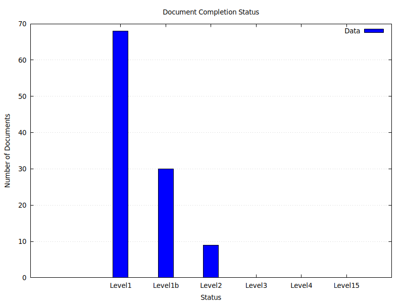

# Review Process

Because there are many stakeholders and dynamic telemetry, each document has a
header that describes the state of review.

The status of documents are included in the status of the document,  eg

```cdocs
author: <name of the primary author>
status: <one of the below status>
```

Below are the different stages:

## Stages of Review

### ReviewLevel1 (Incomplete)

Placeholder; incomplete or unwritten.  Must contain the phrase "COMING SOON" in
the markdown header.

### ReviewLevel1b (Talking Points)

Meeds ReviewLevel1, plus talking points are enumerated. Must contain the phrase
"TALKING_POINTS" in the markdown header.

### ReviewLevel2 (PRE-DRAFT)

Meets ReviewLevel1b, plus document has been created but not ready to take feedback.

### ReviewLevel3 (DRAFT)

Meets ReviewLevel2, but is ready for feedback.

### ReviewLevel4 (PENDING)

Meets ReviewLevel3, has taken feedback, and is generally 'locked'

### ReviewLevel5 (COMPLETE)

Meets ReviewLevel4, and is signed off and 'locked'.  Changes can still be made,
but they're in errata form.

## Status of Documents



## Individual Status


