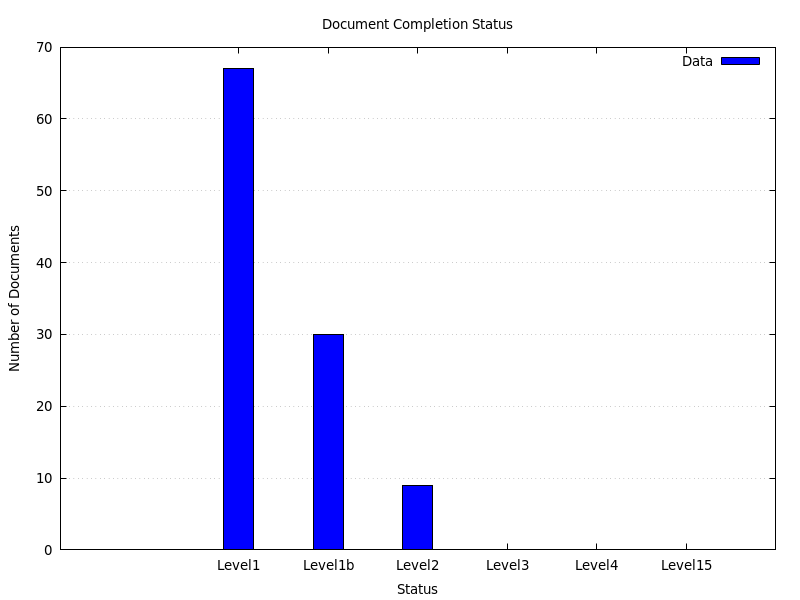

# Review Process
Because there are many stakeholders and dynamic telemetry, each document has a header that describes the state of review.

Below are the different stages:

## Stages of Review

### ReviewLevel1 (Incomplete)
Placeholder; incomplete or unwritten

### ReviewLevel1b (Talking Points)
ReviewLevel1 plus talking points are enumerated

### ReviewLevel2 (PRE-DRAFT)
ReviewLeverl 1b, plus document has been written

### ReviewLevel3 (DRAFT)
ReviewLevel2, but in in review

### ReviewLevel4 (PENDING)
ReviewLevel3, but generally accepted

### ReviewLevel5 (COMPLETE)
ReviewLevel4, signed off

## Status of Documents

## Individual Status

