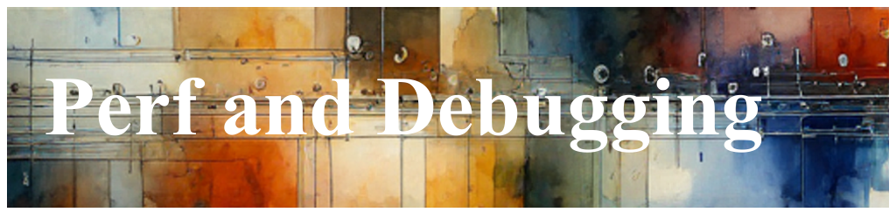

# Performance and Diagnostics, at Scale



With static telemetry, you often depend on luck, intuition, a large budget, or
an oracle because your logging decisions are fixed after deployment. We've all
been there, you're writing a tricky function and have to decide if adding a few
extra logging messages is wise. On one hand, the more logs, the easier
debugging; on the other hand, the logs accumulate, slowing down databases,
costing money, and increasing security and privacy profiles for you and your
users.

The complexity compounds in cases where the software cannot be easily cycled or
where bugs are particularly elusive.

Dynamic Telemetry, provides middle ground; it offers the ability to dynamically
toggle telemetry, either manually or programmatically.

As you start using and learning Dynamic Telemetry, you'll discover how to gamify
debugging by dynamically collecting memory, toggling logs, and employing other
techniques to effectively trap and diagnose bugs.

## Introducing your Tools : [Processors](./Architecture.Components.Processor.Overview.document.md), [Probes](./Architecture.Probes.Overview.document.md), and [Actions](./Architecture.Actions.Overview.document.md)

In Dynamic Telemetry,
[Processors](./Architecture.Components.Processor.Overview.document.md),
[Probes](./Architecture.Probes.Overview.document.md), and
[Actions](./Architecture.Actions.Overview.document.md) play crucial roles in
monitoring and diagnosing system behavior.

The most important concept, if you can only understand one, is the
[Processor](./Architecture.Components.Processor.Overview.document.md).

Think of the Processor as a virtual machine that sits in the middle of all
OpenTelemetry logs. It "sees" all the logs and, based on what it's seeing, can
perform various actions. For example, it might "see" a queue getting really long
and capture a memory dump, or it might "see" connections per second dropping and
start a CPU sample.

[Probes](./Architecture.Probes.Overview.document.md) are simply "something" that
emits a Log, Metric, or Trace, into OpenTelemetry. This could be the simple case
of static logging, but through the use of
[Adapters](./Architecture.Components.FiltersAndRouters.document.md), can be
other technologies like syslog, ETW, user_events, or even more dynamic emitters
like kprobes, uprobes, eBPF, or dtrace.

Actions, on the other hand, initiate specific operations. While they are
designed to avoid altering the system state intentionally, they can be
dynamically enabled or disabled. Typical actions might include enabling CPU
sampling, collecting configurations, managing Flight Recorders, inducing memory
dumps, and gathering other types of state data.

When combined, Probes and Actions create a powerful mechanism to "cast nets"
that catch bugs.


## Understaing by Example : Dynamically Regulating Logging, when things go wrong

Consider a situation where a production system works well during
testing and under light load but experiences unexpectedly high CPU contention
from time to time. Developers have many theories, and little data -- they
suspect the machine could be entering receive livelock but are unsure why.

If they could predict which computer would next exhibit the problem, they could
turn on CPU sampling when the issue occurs. The challenge is that once the
problem arises, it is resolved before they're able to:

- Collect a memory dump to inspect work queues

- Enable CPU sampling to determine which code is heavily utilized,

- Enable verbose diagnostic traces.

By using Dynamic Telemetry effectively, teams can proactively manage and resolve
such issues, improving overall system stability and performance.

## Trapping your Bugs - Dynamically, by Casting 'Nets'

The Diagnostic Telemetry solution to this class of problem involves casting
broad 'nets' on multiple machines expected to encounter this situation. Each net
is very lightweight, with negligible performance or reliability concerns.

These nets are simply configurations for a Dynamic Telemetry Processor that
remain mostly dormant, monitoring selected logging values while waiting for a
triggering condition. Once a triggered, an "Action" is called; which in turn
provides the desired diagnostic information necessary for a root cause.

By configuring the Processor to dynamically monitor these log messages, it can
track the queue depth in real-time. If the queue length exceeds predefined
criteria set in the Processor's configuration, the Processor can initiate
various diagnostic actions such as capturing a memory dump, enabling CPU
sampling, or activating more verbose logging. This dynamic monitoring allows for
proactive detection and response to potential issues, ensuring abnormalities are
promptly addressed, thereby maintaining system stability and performance.

Probes are deployed to monitor specific aspects of the system and emit data when
certain conditions are met. For example, a probe might monitor the return value
of a particular function or track the occurrence of specific events. When a
probe detects something noteworthy, it can trigger an action. This action may
involve collecting additional data, enabling more detailed logging, or capturing
a memory dump.

By dynamically enabling and disabling probes and actions, you can create a
flexible and responsive system that adapts to changing conditions and captures
valuable diagnostic information when needed.

```cdocs_include
{{ CSharp_Include("../LookoutTower/Samples/TriggeringOnQueue/TriggeringOnQueue.cs",
    "//start-SampleWorkQueue",
    "//end-SampleWorkQueue")
}}
```
