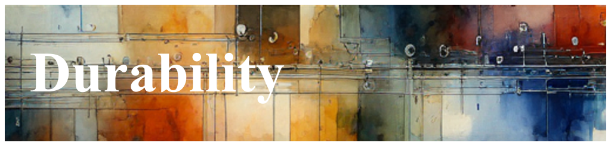

# Environment Migration, Durability

Communicating between different personas within a project can be challenging due
to varying perspectives, priorities, and levels of technical understanding. For
instance, a developer might focus on the intricacies of code and system
performance, while a project manager might prioritize timelines and
deliverables. This disparity can lead to misunderstandings and misaligned
expectations. Additionally, without a common framework or language, conveying
complex technical issues to non-technical stakeholders can be particularly
difficult. This communication gap can hinder the effective collaboration
necessary for the successful completion of a project.

While overly strict and managed payload schemas can enhance communication by
providing clear and consistent data structures, they often introduce what is
perceived as undue management friction. Strict schemas ensure that all team
members, regardless of their technical background, are on the same page, thereby
reducing misunderstandings and facilitating smoother collaboration. However, the
rigidity of these schemas can also stifle innovation and adaptability, as
developers may find themselves constrained by the need to adhere to predefined
data structures. This can lead to increased time spent on management and
compliance, rather than focusing on creative problem-solving and rapid
iteration. As a result, while strict schemas contribute to clearer
communication, they can also slow down the development process and create
frustration among team members who feel restricted by the lack of flexibility.

Maintaining the end-to-end durability of dashboards and alerts becomes even more
complex when there are no predefined data schemas. Without schemas, data can be
inconsistent and unpredictable, making it difficult to ensure that dashboards
and alerts are accurate and reliable. This lack of structure can lead to
significant challenges in data integration, validation, and transformation
processes. Consequently, teams may struggle to maintain the integrity and
consistency of the data, which is crucial for making informed decisions and
taking timely actions.

Durable IDs offer a solution to some of these challenges by providing a
consistent and reliable way to locate specific lines of code or data points.
Much like a GPS system, durable IDs allow developers to pinpoint the exact
location of an issue within the codebase, facilitating quicker and more accurate
debugging and troubleshooting. This precision is invaluable in complex systems
where even minor errors can have significant repercussions. By using durable
IDs, teams can ensure that they are addressing the correct issues without the
risk of misidentification or oversight.

Structured payloads, on the other hand, can provide loose schemas that offer a
balance between flexibility and consistency. These payloads allow for the
inclusion of various data types and structures while maintaining a level of
standardization that facilitates data processing and analysis. This approach
enables teams to adapt to changing requirements and data sources without
compromising the overall integrity and usability of the data.

Dynamic Telemetry log schemas introduce an innovative approach to system
monitoring and diagnostics. Unlike static telemetry, which relies on predefined
data points and structures, Dynamic Telemetry allows for the real-time
adjustment and customization of log schemas based on the current needs and
conditions of the system. This flexibility enables more precise and
context-aware data collection, providing deeper insights into system behavior
and performance. By leveraging dynamic telemetry, teams can enhance their
observability and diagnostic capabilities, leading to more effective monitoring,
quicker issue resolution, and overall improved system reliability.

## Introducing Your Tools : [Routers](./Architecture.Components.FiltersAndRouters.document.md), and [Flight Recorder](./Architecture.FlightRecorder.Overview.document.md)

## Changing Environments;  hosting providers, containers, VM's

TODO;  add content
