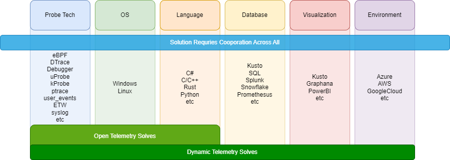

# Dynamic Telemetry

______________________________________________________________________

1. Stitched Together in a way that

______________________________________________________________________

## Previous 2 or 3 years

1. Aligning our API surfaces, core tech
1. Supporting changes made in .NET, OpenTelemetry, and the kernels of Windows
   and Linux
1. Industry / OSS Support
1. Applications ranging from perf/security/cost reductions/AI

______________________________________________________________________

## TLDR; What is Dynamic Telemetry

1. Single Architecture
1. That Connects bespoke telemetry / diagnostic tools
1. Solving and Connecting
1. 'Golden Path' scenarios
   1. Performance and Diagnostics
   1. Security and Privacy
   1. Dashboard and Alert Durability
   1. Cost Reductions
1. Creating Opportunities for AI

______________________________________________________________________

## Our Challenge

(each permutation, is often a whole new architecture requiring extensive
refactoring)

______________________________________________________________________

## Our Opportunity

- Organize API's; Language, OS under Open Telemetry
- Tackle the connections under 'Dynamic Telemetry'; using Scenarios as golden
  paths

______________________________________________________________________

## Actions

- Seek 1P/3P (OSS) Community Agreement on Scenario Workflow; 'Golden Paths'
- Focus on architectural North Star (Probe, Action, Processors, DurableID's)
- Dynamic Telemetry vTeam creates aspirational samples
- As time permits, we collectively turn my Dynamic Telemetry samples, into
  reality

______________________________________________________________________

## Why DurableID's and structured payloads are helpful

- Regular Expressions are fragile, confusing, and expensive
- Durable ID provides a sort of 'GPS' to find the file and line
- Structured Payloads allow easier reasoning over data

______________________________________________________________________

## Risks

______________________________________________________________________

## Scenarios

- Performance and Diagnostics
- Security and Privacy
- Reliability
- Durable Dashboards and Alerts
- Cost Reduction
- Opportunities for AI

______________________________________________________________________

## Architecture

______________________________________________________________________

## Diagnostics (aka Touch Reduction)

- DurableID's and Structured Payloads can be used to Trigger
- Memory Dumps, CPU samples, more verbose Logging

______________________________________________________________________

## Security and Privacy

- in SFI/Azure we've had problems with embedded PATs, certs
- in GDPR/Client we've had problems with IP addresses, MAC/BSSID/SSID's

______________________________________________________________________

## Cost Reduction

- Logging is expensive
- Not all Logs are great or always needed
- Through positive identification
  - we can toggle
  - we can drop/modify

______________________________________________________________________

## Opens up new Opportunities for AI

- With Strings being CHEAP - more options
- Reduce Volume
- Reduce Costs
- Reduce Privacy / Security Exposure
