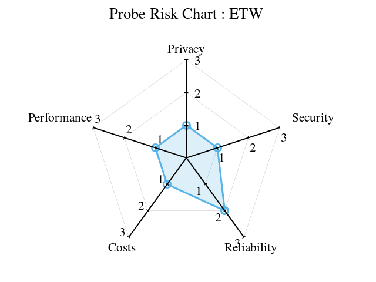

# Coming Soon

# Coming Soon

Understanding an action in Dynamic Telemetry is crucial for grasping its
workflows. An action involves diagnostic operations that do not alter
system state and can be dynamically enabled or disabled using a provided
program.

Unlike mitigation actions, these do not modify system state.

Examples of actions unsuitable for Dynamic Telemetry include restarting
a service, rebooting a machine, writing to a file, or changing a config
setting.

Suitable actions might involve enabling CPU sampling, which could impact
performance but doesn\'t intentionally modify system state.

The following sections will discuss sample actions within the scope of
Dynamic Telemetry, such as collecting configurations, enabling CPU
sampling, managing flight recorders, inducing memory dumps, and
collecting other state types.

# Coming Soon

# Coming Soon

# Coming Soon

# Coming Soon

# Coming Soon

# Coming Soon

# Coming Soon

# Coming Soon

# Coming Soon

# Coming Soon

# Coming Soon

# Coming Soon

# Coming Soon

# PROCESSOR : Query Language

The query language processor is one of the most straightforward
processors available. It presents minimal risk while still providing
valuable capabilities for dynamic modeling and system understanding. The
query language processor can be likened to command line tools found on
all operating systems, which manipulate standard IO subsystems.

## Introduction to Query Language Processor

The query language processor integrates into the logging stream,
monitoring events by applying straightforward query language filtering
and aggregate functions. Unlike other processors within dynamic
telemetry, the query language processor is designed solely for filtering
and aggregating data. It does not enable the invocation of actions,
which significantly reduces its associated risks in the risk taxonomy.

## Simple Code Example; hashing files

``` cdocs


```

## Query Language Overview

In this example you'll notice that the example code

1.  Logs when we begin hashing
2.  Hashs the file; or otherwise perform business logic
3.  Logs when we've completed the hashing of the file

This workflow outlines a typical sequence of operations for a developer.
Log messages may be disabled before entering production, used during
diagnostics, or employed to indicate failure and success in traditional
testing.

## Modeling Live System Behavior, with a Query Language Processor

An example use of the query language processor is to suppress highly
chatty events. Suppose we find that we are hashing many files and want
to keep track of the count without needing file names or statuses. This
often happens after deployment when it\'s realized that such
functionality costs more than anticipated.

To address this, a simple aggregate function can be sent to the Dynamic
Telemetry Query Language processor to filter these events or aggregate
in-memory statistics if they are still needed.

### Suppressing Unneeded / Chatty Events

### Aggregating Chatty Events

Lets look at a few examples, as they likely will help tell the tale

Image a piece of code that looks something like this:


## Example Scenarios



# PROCESSOR : State Machine

The state machine processor is a relatively simple yet highly effective
component within dynamic telemetry. Essentially, this processor listens
to all log messages that pass by, identifying significant events and
managing a state machine based on those events. When the state machine
processor detects an interesting log message, it transitions to a new
state, potentially initiating an action as part of this transition.

## Introduction to State Machine Processor

The State Machine processor operates as a Directed Graph, where
transitions occur upon the observation of specific logs by the
Processor. This state machine is employed for tasks such as timing,
counting, and measuring in contexts that pose significant challenges.
The state machine is often accompanied by various actions and is
utilized to initiate complex or resource-intensive operations.

Its primary function is to monitor logs and transition between states
based on the analysis of log names and parameters. Initially, the state
machine starts in an undefined state and then dynamically adjusts its
state in response to the events it processes. This method is
particularly effective for tasks such as timing, counting, and measuring
in difficult contexts.

To provide an example, consider generating unique hashes of a file, such
as data files or JPEG images.

## Simple Code Example; hashing files

``` cdocs


```

## Sample Code Overview

In this example you'll notice that the example code

1.  Logs when we begin hashing
2.  Hashs the file; or otherwise perform business logic
3.  Logs when we've completed the hashing of the file

This workflow outlines a typical sequence of operations for a developer.
Log messages may be disabled before entering production, used during
diagnostics, or employed to indicate failure and success in traditional
testing.

## Modeling Live System Behavior, with a State Machine Processor

Consider the state model processor as a tool to quickly and safely
understand the system\'s operational characteristics after deployment.

The state machine processor is typically beneficial in scenarios where
software has been deployed into a production environment, and it cannot
be rapidly altered or redeployed. It should be viewed as a diagnostic
tool that can be employed extensively without affecting user security,
privacy, or performance.

After a conclusion is reached by the state machine processor, the
production code is frequently modified to implement a more suitable and
permanent solution. Consequently, the state machine processor can be
deactivated once the revised deployment is completed.

Lets look at a few examples, as they likely will help tell the tale

Image a piece of code that looks something like this:


## Introducing Actions to the Dynamic Telemetry State Machine

## Useful Actions

-   [CPU Sampling](./Architecture.Action.CPUSample.document.md)
-   [Verbose Logs](./Architecture.Action.VerboseLogs.document.md)
-   [Memory Dump](./PositionPaper.TriggeredMemoryDump.document.md)

## Example Scenarios



# PROCESSOR : Language

The language processor is one of the most versatile and capable
processors within dynamic telemetry; however, it also poses certain
risks. The language processor in dynamic telemetry enables the insertion
of programming language into the telemetry and logging stream of a
process. These instructions will have the full functionality of the
supporting programming language and runtime.

## Introduction to Language Processor

By incorporating a programming model into a telemetry stream, advanced
observability and diagnostics can be achieved. For example, memory
variables can be created, aggregates can be managed, individual threads
can be monitored, and references can be tracked.

Additionally, complex triggering scenarios can be established, such as
capturing a memory dump of a process when a reference count exceeds
nominal and expected values.

## Simple Code Example; hashing files

``` cdocs

```

## Sample Code Overview

In this example you'll notice that the example code

1.  Logs when we begin hashing
2.  Hashs the file; or otherwise perform business logic
3.  Logs when we've completed the hashing of the file

This workflow outlines a typical sequence of operations for a developer.
Log messages may be disabled before entering production, used during
diagnostics, or employed to indicate failure and success in traditional
testing.

## Modeling Live System Behavior, with a Language Processor.

In this scenario, where a file is being hashed, assume there is a bug in
the hashing algorithm. For example, the implementation of the hashing
algorithm might have race conditions or, in exceptional cases, memory
misalignment. If one of these issues occurs, the hash for the input file
will be incorrect, making it challenging to debug in a production
system.

A Dynamic Telemetry Language Processor could be particularly useful for
advanced diagnostics and tracking of this faulty hashing algorithm.

in this example one could imagine the pseudo code below being utilized
in a randomized pattern and deployed using dynamic telemetry into a
production environment as you can see in the pseudo code periodically
the hash of a file will be doubly computed once in the production code
and secondarily in the telemetry code

when or if hash is detected to be incorrect the dynamic telemetry
language processor is able to emit extra to diagnostic telemetry that
indicates to the programmer who is monitoring the back end databases
that in fact the hashing algorithm is failing

Lets look at a few examples, as they likely will help tell the tale

Image a piece of code that looks something like this:


### Verifying Hash Algorithm

``` cdocs

```

## Introducing Actions to the Dynamic Telemetry Language Processor

## Useful Actions

-   [CPU Sampling](./Architecture.Action.CPUSample.document.md)
-   [Verbose Logs](./Architecture.Action.VerboseLogs.document.md)
-   [Memory Dump](./Architecture.Action.MemoryDump.document.md)

## Example Scenarios



# Coming Soon

# Coming Soon

# Coming Soon

# Coming Soon

# Coming Soon

# Coming Soon

# Coming Soon

# Overview of Key Constructs; Actions and Probes

If there is any aspect of Dynamic Telemetry that requires thorough
understanding, it is the critical distinction between static telemetry
and Dynamic Telemetry. At its core, this distinction represents the
transition from hard-coded, static assets to more versatile and
utilitarian Dynamic Telemetry. This concept forms the foundation of
Dynamic Telemetry.

There are two crucial classifications of enhancements applied to
telemetry: traditional telemetry markers. These classifications are: (1)
the **Action**, and (2) the **Probe**.

A deeper discussion will be presented in subsequent subsections.
Generally, a probe refers to an element that can be added to software,
emitting information that can be dynamically used and modeled during
runtime in ways unanticipated by the original programmer.

The second concept involves actions---when a probe identifies something
of interest, a state machine can be dynamically deployed and attached to
the running system without compromising its security and privacy. An
action involves collecting information that was not previously gathered
before the implementation of Dynamic Telemetry.

# DynamicTelemetry Philosophy

DynamicTelemetry is an articulation of the emobodiemnt of a suite of
Observablity tools, designed to manage, control, and reshape telemetry
in [Production](./PositionPaper.DefiningProduction.document.md) systems.

Essentially, DynamicTelemetry is a set of enforced conventions that
enable various sophisticated diagnostic systems to work in harmony. It
ensures compatibility with user privacy and security needs.
Simultaneously, DynamicTelemetry provides businesses with the ability to
adjust their Observability based on necessity. This allows resources to
be allocated when needed and restricts telemetry when it's not required.

This document aims to delve into the philosophy of DynamicTelemetry,
exploring the intricate balance between complex realities. While this
document serves as a comprehensive spiritual guide, some readers might
find it beneficial to start with the usage
[scenarios](./Scenarios.Overview.document.md) to get a better
understanding of the system.

## DynamicTelemetry, in a nutshell

[Demos](./Demos.1_IntroDemo.md) are a great way to go hands on with
DynamicTelemetry, but before diving in to the complex realities
DynamicTelemetry seeks to resolve, it's important to have a general
undertqnding of usage.

Image yourself as a [DEVELOPER](./Persona_Developer.document.md). You're
focused on the latest business needs from your
[PROJECTMANAGER](./Persona_ProjectManager.document.md). You're worried
about solving business problems, keeping costs in check,

## OnBox Architecture


## Tenants

``` cdocs

```

# PROBE : DTrace (Probe.DTrace.document)


## Introduction to DTrace

# PROBE : ETW



# PROBE : OpenTelemetry


# PROBE : eBPF


# PROBE : pTrace


# PROBE : uprobe


# PROBE : user_events


# Probe Explanation

In DynamicTelemetry a "[PROBE](./Definitions.document.md#PROBE)" is the
base case abstraction for all means of measure. PROBES extract
information from the working system, and convert them into a schematized
OpenTelemetry Log, Metric, or Trace.

## Introduction

In the realm of system monitoring and data analysis, DynamicTelemetry
introduces a unique and efficient component known as a "probe". A probe,
in the context of DynamicTelemetry, is a dynamic element that is capable
of producing small quantities of valuable data. This data, often derived
from various operations and processes within the system, serves as a
rich source of information for analysis and troubleshooting.

The defining characteristic of these probes is their non-disruptive
nature. They are designed to operate seamlessly within the system
without causing any disruption to the machine's performance or quality.
This means that while these probes are actively extracting and producing
data, they do not cause any noticeable slowdown or alteration in the
system's operations.

This non-intrusive and efficient data production makes probes an
integral part of DynamicTelemetry, enabling it to monitor system
performance, detect anomalies, and provide valuable insights for system
optimization. The use of probes underscores DynamicTelemetry's
commitment to maintaining system integrity while providing a robust and
comprehensive monitoring solution.

## Course Types of Probes

### Static probes

are those that are always active and continuously monitor the system.
They are less risky and more performance expensive. Examples include ETW
on Windows and syslog, LTG user events, and perf on Linux1.

### Dynamic probes

on the other hand, are those that can be enabled or disabled as needed.
They are more flexible and can provide rich information quickly when
enabled. However, they can be more risky as they might modify the
system, like E BPF1.

DynamicTelemetry allows you to dynamically and quickly enable a probe to
extract information and egress it into your standard existing open
telemetry workflows. This can be particularly useful in a production
system where a probe might be disabled1.

However, it's important to note that using probes, especially dynamic
ones, could potentially impact system performance. Therefore,
DynamicTelemetry has safeguards to restrict this impact1.

## Examples of Probes

Probes can be found in various systems, each tailored to the specific
environment and requirements of that system. They are designed to
seamlessly integrate with the system's operations, providing valuable
data without causing any disruption.

On Windows, one such example of a probe is Event Tracing for Windows
(ETW). ETW is a powerful tracing tool provided by the Windows operating
system. It allows developers to both log real-time binary events and
instrument their applications and the system to capture events. These
events can then be used to analyze the performance and diagnose issues,
making ETW a valuable probe in the Windows environment.

In the Linux ecosystem, there are several examples of probes. Syslog,
for instance, is a standard for message logging. It allows for the
separation of the software that generates messages, the system that
stores them, and the software that reports and analyzes them. This makes
Syslog a versatile and valuable probe in a Linux environment.

Another example in Linux is LTG (Linux Trace Toolkit) user events. These
are a type of probe that provides a mechanism to trace and monitor
user-space applications and correlate activities with kernel-space
events. This correlation provides a comprehensive view of the system's
behavior, making LTG user events a valuable probe.

Perf is yet another example of a probe in Linux. It is a powerful tool
that can be used to count events and monitor certain aspects of software
and hardware, providing valuable data for performance analysis.

These examples illustrate the diversity and adaptability of probes
across different systems. Despite their differences, all probes share
the common goal of providing valuable, non-disruptive data for system
monitoring and analysis.

## Use of Probes in DynamicTelemetry

In the DynamicTelemetry system, probes serve as dynamic data sources
that can be enabled or disabled as needed. This flexibility is crucial
in a production environment where unnecessary data collection can lead
to performance degradation.

When a probe is disabled, it remains dormant within the system, not
contributing any data or consuming any resources. However, the true
power of probes comes to light when they are enabled. With
DynamicTelemetry, users can dynamically enable a probe when they need to
extract specific information from the system. This process is quick and
efficient, allowing users to gather valuable data on-demand without any
significant impact on system performance.

Once a probe is enabled, it begins to emit data that is then egressed
into the open telemetry workflows. For instance, a user could turn on a
U probe to monitor the return value for a particular function. This data
is then sent to open telemetry for further processing and analysis.

The role of DynamicTelemetry in this process is to facilitate the
dynamic enabling of probes and the initial extraction of data. Once the
data is emitted to open telemetry, DynamicTelemetry's role ends. The
data is then handled by the standard egressing mechanisms of open
telemetry, which could involve various processes such as aggregation,
counting, or direct emission as a log.

This dynamic and on-demand use of probes makes DynamicTelemetry a
powerful tool for real-time system monitoring and data extraction. It
allows users to gather rich, valuable data when they need it, providing
insights that can help optimize system performance and troubleshoot
issues.

## Performance Impact and Safeguards of Probes in DynamicTelemetry

The use of probes in DynamicTelemetry can potentially impact system
performance. This is primarily due to the frequent emission of logs,
which could consume system resources and affect performance. However,
DynamicTelemetry is designed with this consideration in mind and
includes several safeguards to mitigate this impact.

One of the key principles of DynamicTelemetry is to ensure that the use
of probes does not compromise system performance. To achieve this,
DynamicTelemetry has implemented mechanisms to restrict the frequency
and volume of log emissions. These mechanisms are designed to balance
the need for detailed data with the necessity of maintaining optimal
system performance.

For instance, DynamicTelemetry may limit the number of logs that a probe
can emit within a certain timeframe. This prevents a probe from
overwhelming the system with excessive data. Additionally,
DynamicTelemetry may also implement safeguards at the probe level, such
as limiting the amount of data that a probe can extract or the resources
that it can consume.

These safeguards ensure that the use of probes in DynamicTelemetry
remains efficient and non-disruptive. They allow DynamicTelemetry to
provide detailed and valuable data without compromising the performance
of the system. This makes DynamicTelemetry a reliable tool for system
monitoring and data analysis, capable of providing rich insights while
maintaining system integrity and performance.

ToDo:

-   Risk vs. Perf axis
-   Discuss operations that can occur to a probe
-   Contrast a probe from a breakpoint
-   Talk about how Logs/Traces can be used as probes
-   Link to Observer Effect
-   Link to Risk Levels

## Probe Characteristics

1.  Intentionally READ-ONLY; this is a 'hard and fast' rule in
    OpenTelemetry that may box out some very powerful opportunities.

2.  Intentionally INEXPENSIVE to performance

## READONLY

## INEXPENSIVE

## Probe Risk

Probes inherently pose risks to
[Production](./PositionPaper.DefiningProduction.document.md) systems.
These risks manifest in various forms. DynamicTelemetry aims to mitigate
these risks across five different dimensions: Privacy, Security,
Reliability, Cost, and Performance.

This document provides a framework for understanding these risks and the
mitigation techniques used, as discussed in the [Observer
Effect](./PositionPaper.ObserverEffect.document.md).

## Probe Risk mitigation's

### Privacy

Mitigation:

1.  READ-ONLY: intentionally a PROBE does not alter the functionally of
    a system

2.  [Configuration
    Deployment](./PositionPaper.ConfigurationDeployment.document.md);
    PROBE configurations are always deployed with the same oversight as
    production code.

3.  [Privacy](./PositionPaper.TelemetryUmbilical.document.md)

### Security

### Reliability

### Cost

### Performance

## Probe Values

-   Local Suppression
-   Remote Suppression

  Value           Remote Mitigations   Local Mitigations
  --------------- -------------------- -------------------
  1 (low risk)    :smiley:             :smiley:
  2 (med risk)                         :smiley:
  3 (high risk)                        

## Linux Probe Types (and their risks)

### OpenTelemetry


### DTrace


### eBPF


### ptrace


### uprobes


### user_events


## Windows Probe Types (and their risks)

### ETW


### eBPF


# Definitions

  -------------------------------------------------------------------------------------------------------------------------------------------------------------
  TERM                                                      DEFINITION
  --------------------------------------------------------- ---------------------------------------------------------------------------------------------------
  `<a name="BUGBEACON">`{=html}BUGBEACON`</A>`{=html}       A library of 'active comments' - an SDK that emits on schematized OpenTelemetry, to maximize the
                                                            impact of in-place Observability. Simplifying and maximizing use with DynamicTelemetry.

  `<a name="PROBE">`{=html} PROBE`</A>`{=html}              In DynamicTelemetry a [PROBE](./Architecture.Probes.Overview.document.md) is the base case
                                                            abstraction for all means of measure.PROBES extract information from the working system, and
                                                            convert them into a schematized OpenTelemetry Log, Metric, or Trace. Comfortable (and common)
                                                            examples include ETW, SYSLOG, USER_EVENTS. More advanced examples include UPROBES and DTRACE.

  `<a name="ETW">`{=html}ETW = Event Tracing,               [Windows in box tracing](https://docs.kernel.org/6.1/trace/uprobetracer.html). There are a few
  Windows`</A>`{=html}                                      'flavors' of ETW -
                                                            [TraceLogging](https://learn.microsoft.com/en-us/windows/win32/tracelogging/trace-logging-portal)
                                                            is the preferred flavor for DynamicTelemetry, because it's internally manifested' and its events
                                                            are self describing, such that they can be decoded without manifest.

  `<a name="PROBE">`{=html}UPROBE`</A>`{=html}              [kernel.org](https://docs.kernel.org/6.1/trace/uprobetracer.html). Basically a kernel supported
                                                            breakpoint mechanism.

  `<a name="DTRACE">`{=html}DTRACE`</A>`{=html}             [msdn](hhttps://learn.microsoft.com/en-us/windows-hardware/drivers/devtest/dtrace)

  `<a name="SYSLOG">`{=html}SYSLOG`</A>`{=html}             TBD

  `<a name="USER_EVENTS">`{=html}USER_EVENTS`</A>`{=html}   TBD
  -------------------------------------------------------------------------------------------------------------------------------------------------------------

# DynamicTelemetry : Introduction Demo

1.  Showcase each of the big pieces
2.  Line of code along with a OpenTelemetry log
3.  UI to configure a trigger
4.  deploy
5.  view results in Grafana and Kusto

## Architectural Overview Video #2

Introducing DynamicTelemetry, an OpenSource, diagnostic compliment to
OpenTelemetry.

The DynamicTelemetry development team wants to make debugging production
software as easy and enjoyable as debugging locally. We want you to be
able to diagnose and explore live production systems without
compromising reliability, performance, or customer privacy.

In this video, we will give you an overview of the main architectural
components of DynamicTelemetry. As you watch the video, please pay
attention to the following points:

-   DynamicTelemetry builds on popular open source tools and libraries
    like OpenTelemetry, Grafana, and Prometheus

-   DynamicTelemetry lets you dynamically reshape your existing
    OpenTelemetry, without redploying.

-   Lets dive into some scenario demos. Each of these demos is additive,

    -   Suppress all or portions of Logs and Traces, convert Logs into
        Metrics
    -   Create new Logs, based on dynamically applied state machines
    -   Or even create Telemetry, where it doesnt exist - by applying a
        dynamic probe

# DynamicTelemetry : Demo 1, adding Telemetry dynamiclly

In this demonstration, we'll be utilizing DynamicTelemetry to generate
telemetry for code that's already been deployed in a Production
environment.

Consider a scenario where a certain piece of code is operational within
a Production Kubernetes cluster. A quick review of this code reveals a
complete absence of telemetry. ...and a curiousity that we'll explore!

Please quickly study this code, it's a simple "Tower of Hanoi" problem,
like every college freshman studies in CS101. Unique to this code, you
will notice the absense of telemetry and certainly no OpenTelemetry.

To address this issue, we will establish a dynamic probe and connect it
to the active process. This probe utilizes technology akin to what's
found in symbolic debuggers such as Visual Studio, windbg, or gdb. Its
function is to gather minimal amounts of memory, transform them into
standard OpenTelemetry Logs, and then directly feed them into your
existing OpenTelemetry pipelines.

Once emitted, these new Logs will work no differently to any other
OpenTelemetry. All your Graphana, Prometheus, or Azure Dev Explorer
tooling will work as they do today.

To set up the dynamic probe, we just need to highlight the interesting
function and press F9 key in Visual Studio Code. After that, we switch
to the DynamicTelemetry. If our security and privacy guidelines allow
this kind of probing, it will then be implemented on the targeted
machines.

Within minutes, the new OpenTelemetry Logs and Metrics will be emitted
to your existing OpenTelemetry pipeline. You'll see the values appear
for use within Graphana, Azure Data Explorer, or any other OpenTelemtry
compatible services you have installed.

# 


Interactive Observability

## Setup

``` cdocs
helm repo add jaegertracing https://jaegertracing.github.io/helm-charts
helm repo add grafana https://grafana.github.io/helm-charts
helm repo add prometheus-community https://prometheus-community.github.io/helm-charts
helm repo add open-telemetry https://open-telemetry.github.io/opentelemetry-helm-charts
```

## Scenario #1 : reduce log volume by dropping 5x events

-   OpenTelemetry configured to emit at some level (Info?)
-   OpenTelemetry configured to emit into Kusto
-   Launch Kusto, do \| summarize count() by eventId
-   find 5 events that can be silenced
-   in under 5 seconds, suppress those 5 events, and the expensive
    fields from the 3 other events
-   in \~5 minutes (Kusto ingestion lag) verify the correct things
    happened

## Scenario #2 : improve privacy, by dropping 3x event fields

-   OpenTelemetry configured to emit at some level (Info?)
-   OpenTelemetry configured to emit into Kusto
-   Launch Kusto, locate 3x events that contain a field that should not
    be egressed for privacy (or data size) reasons
-   find 3 events that have a very expensive field
-   in under 5 seconds, suppress just the 3x fields - all other fields
    should remain
-   in \~5 minutes (Kusto ingestion lag) verify the correct things
    happened

## Scenario #3 : count the number of errors, bucketed by error code, but only when we're in a particular state

## Installation Notes

``` cdocs
https://minikube.sigs.k8s.io/docs/start/
curl -LO https://storage.googleapis.com/minikube/releases/latest/minikube_latest_amd64.deb
sudo dpkg -i minikube_latest_amd64.deb
```

# Adding a forgotten Session ID to a Log

1.  Use eBPF to retrieve a Session ID from an adjacent log, on the same
    thread
2.  Add the log to the new event

# DynamicTelemetry Persona : DEVOPS Persona

DynamicTelemetry personas are intended as an organizational aid to group
capabilities and usability of common usage scenarios. Browsing between
scenarios is recommended, for the personas are intended only as an aid.

## Introduction

The DATA_ANALYST Persona in DynamicTelemetry:

1.  Looks for patterns - has a background in math, AI, big data,
    statistics, etc
2.  Apprecates (but doesn't necessarily depend on) schematized data,
    with crisp contracts
3.  Is well versed and comfortable with the differences between security
    and privacy. Knows how to protect users.

## Scenarios

1.  [Bug Beacon](./PositionPaper.ClearFailuresViaSchema.document.md)
2.  [A/B Feature
    Testing](./PositionPaper.ABTestingWithRichDiagnostics.document.md)
3.  [Catagorized/Schematized
    Failures](./PositionPaper.ClearFailuresViaSchema.document.md)
4.  [Triggered Flight
    Recorder](./PositionPaper.TriggeredFlightRecorder.document.md)

## Notes (To Be Deleted)


# DynamicTelemetry Persona : DEVOPS Persona

DynamicTelemetry personas are intended as an organizational aid to group
capabilities and usability of common usage scenarios. Browsing between
scenarios is recommended, for the personas are intended only as an aid.

## Introduction

The DEVOPS Persona in DynamicTelemetry:

1.  Scales virtual assets, like containers and VM's - firsthand
2.  Understands how databases, alerting, and bug tracking systems are
    interconnected
3.  Knows when to reset virtual assets, and when to debug
4.  Is well versed and comfortable with the differences between security
    and privacy. Knows how to protect users.

## Notes (To Be Deleted)


# DynamicTelemetry Persona : DEVELOPER Persona

DynamicTelemetry personas are intended as an organizational aid to group
capabilities and usability of common usage scenarios. Browsing between
scenarios is recommended, for the personas are intended only as an aid.

## Introduction

The DEVELOPER Persona in DynamicTelemetry:

1.  *Authors code*, firsthand
2.  Understands *technical details* like data schemas, instruction
    pointers, and can differentiate logs/traces from metrics.
3.  Comfortable with *core operating system concepts*, like threads,
    heaps, and stacks
4.  Understands *symbolic debuggers*, code offsets, and symbols
5.  Is well versed and comfortable with the differences between security
    and privacy. Knows how to protect users.

## Scenarios

1.  [Bug Beacon](./PositionPaper.ClearFailuresViaSchema.document.md)
2.  [A/B Feature
    Testing](./PositionPaper.ABTestingWithRichDiagnostics.document.md)
3.  [Catagorized/Schematized
    Failures](./PositionPaper.ClearFailuresViaSchema.document.md)
4.  [Triggered Flight
    Recorder](./PositionPaper.TriggeredFlightRecorder.document.md)
5.  [Triggered Memory
    Dump](./PositionPaper.TriggeredMemoryDump.document.md)
6.  [Extracting Memory - dynamic probe
    insertion](./Scenarios.ExtractingMemoryWithUProbe.document.md)
7.  [Memory Leaks](./Scenarios.MemoryLeak.document.md)

## Notes (To Be Deleted)


# DynamicTelemetry Persona : Project Managment

DynamicTelemetry personas are intended as an organizational aid to group
capabilities and usability of common usage scenarios. Browsing between
scenarios is recommended, for the personas are intended only as an aid.

## Introduction

The PROJECT_MANAGER Persona in DynamicTelemetry:

1.  Focuses on solving business problems - if technology meets the needs
    of users

2.  Is concerned with costs

3.  Is concerned about schedule, timelines

4.  Is concerned about balancing quality, product applicability, and
    features

5.  Balances mutiple environments

6.  Is well versed and comfortablze with the differences between
    security and privacy. Knows how to protect users.

7.  [Clear Failujres via
    Schemas](./PositionPaper.ClearFailuresViaSchema.document.md)

8.  [Triggered Flight
    Recorder](./PositionPaper.TriggeredFlightRecorder.document.md)

## Scenarios


# Using Personas to help shape your journey in DynamicTelemetry

DynamicTelemetry is a complex and highly technical subject that can be
challenging for various job positions to navigate.

By framing the book with personas, I aim to facilitate your focus on the
most relevant content while allowing you to bypass information that is
not immediately of interest. This approach should streamline the
discovery of pertinent information.

The personas are based on fictional job descriptions that reflect my
experiences at Microsoft. They represent the target audiences for this
book. I will endeavor to develop these personas and highlight common
needs, confusions, preferences, and pain points.

In the context of DynamicTelemetry, personas can be particularly
beneficial in guiding users to find specific information. Given the
extensive and technical nature of the topic, the vast amount of existing
technologies, the design patters, and the core technical principles -
you'll realize how it is to become overwhelmed by the details.

I encourage you to utilize these personas when designing and
architecting key components of DynamicTelemetry. This practice will help
ensure that the content remains focused and relevant to our shared
target audiences, preventing the book, accompanying websites, and
supplementary software from becoming too broad or unfocused.
Consequently, it will be easier for our readers to locate the
information they seek.

I will strive to use these personas as an organizational tool to
structure the content effectively, providing a framework for determining
which topics and ideas should be included and how they should be
presented.

# Coming Soon

# Coming Soon

# Coming Soon

# Coming Soon

# Configuration Deployment

## Mechanisms

1.  All [PROBE's](./Definitions.document.md#PROBE) must be intentionally
    read-only

2.  Configuration Code Review; two trained employees verify the
    [PROBE](./Definitions.document.md#PROBE) will not collect unapproved
    information.

3.  Ringed Deployment; instead of deploying to all machines, intantly,
    deploymens can be deployed slowly

4.  'Rip Cords'; near instant disablement in the case of emergency

## Observer Effect

[Observer Effect](./PositionPaper.ObserverEffect.document.md)

# Coming Soon

# Coming Soon

# Coming Soon

# What is Production?

# Coming Soon

# Durable ID's and Structured Payloads

In Telemetry/Observably, we often have need to locate the exact file and
line of code that emitted a log message. We also often need to be able
to decode the event, in ways that allow for searching and locating for
arguments passed into that log event.

Applications are many, but include reducing financial costs, quicker
time to diagnosis by leveraging database tools and techniques, graphical
tooling, visual pivoting, sorting, and time ordering aggregations. More
advanced applications, that will be described later in this document,
include "triggering" - where an event being emitted can be used to
trigger memory dumps, CPU sampling, or even enable the production of
more telemetry on command.

Triggering dramatically expands opportunities in "touchless"
(non-interactive) debugging. Triggers allow "traps" to be set for bugs,
where the telemetry system can lay in wait, watching for a bug to
manifest - and when it does! ...the TRIGGER can spring in action,
capturing memory dumps, CPU call stack sampling, or even can dial up
extra telemetry collection.

The importance of DuableID's and Structured Payloads cannot be
overstated - projects running on millions or billions of machines, that
do not make use of API's equipped with DurableID's and Structured
Payloads are almost a guaranteed to be on the path to either struggle to
be diagnosed, or will be migrating within a few years to a new telemetry
system. Of course, there are notable exceptions with niche applications;
LED's, buzzers, and oscilloscopes also still serve their purpose, as do
API's like syslog and printf.

The claim isn't that API's without structured payloads and durable ID's
aren't valuable; they are valuable - however in applications where one
entity/company is responsible for managing millions of machines, with
potentially billions of dollars in years telemetry expenses -the claim
is these API's should be procedurally banned for the reasons outlined in
this document.

## Introduction : It's all about positively identifying the line of code

Lets start the introduction, by showing an event that contains both a
DurableID and Structured Payload. We will then outline why the ID and
payload are both important and valuable. In both examples, it's assumed
there exists a means of egressing the telemetry to a remote database


After the example, we will then outline why the Durable ID and
Structured Payload is both important and valuable.

### Whats 'success' looks like

1.  EXAMPLE #1 (GOOD!)

``` cdocs

LoggingWrite(
        g_Handle,
        "MemoryStatusUpdate",               <-- DurableID
        LoggingUInt32(value, "UpdateValue") <-- Structured Payload (U32/string)
        );
```

### EXAMPLE #2 (BAD!)

``` cdocs

LoggingWrite("UPDATING VALUE: updating value to %d", value);
```

### Materially how do these differ?

In both these examples, the "UpdateValue" will be passed to the
"TELEMETRY_LIBRARY" using a "FUNCTION_CALL", the "TELEMETRY_LIBRARY"
will then encode the data using some means (discussed below), and then
passed over the network, to a database, for insertion into a table.

Before looking at the values in the database tables, imagine each of the
examples are encoded in a similarly the below; this is the
"ENCODED_DATA" boundary below - before being passed off to the Operating
Systems telemetry plumbing.

``` cdocs
# EXAMPLE1: with DurableId/Structured Payload
[DurableID][UdateValue]                          <-- potentially compact

vs.

# EXAMPLE2 : without DurableID and Structured Payload
UPDATING VALUE: updating value to <value>      <-- not as compact
```

This difference is due to what we're calling "flattening" in this
writeup. The term is defined more below; but the gist is the dynamic
portions of the log are squished, by the TELEMETRY_LIBRARY into one
string, before being passed into the telemetry subsystem.

While both are equally useful for searching once entered into a
database, the first example will be easier to search and filter. For
example, the search query for "what hour of the day are updates of value
\> 10 most common?"

### What is "flattening"

Only EXAMPLE#2 is flattening the payload - at the FUNCTION_CALL boundary
the TELEMETRY_LIBRARY will be passed two items

1.  "UPDATING VALUE: updating value to %d"
2.  10

Inside of TELEMETRY_LIBRARY, it'll then "flatten" these two values into
one string "UPDATING VALUE: updating value to 10"

From there, this string becomes the "ENCODED_DATA" passed into the
Operating System, heading to be ingested into a Database Table.

To start understanding why this is fatal to a TELEMETRY_LIBRARY, imagine
the code in EXAMPLE#2 code executing three times - emitting the
following strings into a database

  Time       Message
  ---------- --------------------------------------
  12:01:00   UPDATING VALUE: updating value to 10
  12:02:00   UPDATING VALUE: updating value to 23
  12:03:00   UPDATING VALUE: updating value to 56

...this doesn't seem horrible right? ...we'll expand why this is bad in
a future section.

But for now, to provide contrast - imagine the code in EXAMPLE#1 also
executing three times - emitting the telemetry into a database

  Time       DurableID            UpdateValue
  ---------- -------------------- -------------
  12:01:00   MemoryStatusUpdate   10
  12:02:00   MemoryStatusUpdate   23
  12:03:00   MemoryStatusUpdate   56

Notice how each of these entries coming from EXAMPLE#1 more organized?
While the data from EXAMPLE#2 potentially can be searched in an
emergency, doing this programmatically will be so difficult it needs to
be considered impossible in all situations but real problem.

The root problem is that **in the database, we cannot positively
identify the file+line of code that produced the telemetry**

## Applications

Applications for DurableID's and Structured Payloads are not hard to
discover, once one starts looking.

The "trick" to finding applications is the realization that any event
can be searched, located, and aggregated quickly.

The searching doesn't have to be limited to a database - it's common to
have on box searching (aka "TRIGGERING"). Triggering only means having a
program (usually one that is configured dynamically) to "trigger" when a
particular event, with particular payload, is encountered.

### DurableID Applications

1.  Cost Reduction; locating particularly expensive lines of code
2.  Graphical Tooling; searching/sorting/partitioning of data (WPA,
    Excel)
3.  Event Down-Sampling (eg: "collect all events but this set ...")
4.  Event Up-Sampling (eg: "only collect this set of events ...")

### Structured Payloads

1.  Cost Reduction
    1.  Locating expensive failure conditions, or cases where code
        changes are needed
    2.  Minimizing Database compute time, by indexing on values
2.  Diagnostic Triggering (more below)
    1.  CPU Sampling
    2.  Memory Dumps
    3.  Verbose Logging
    4.  Packet Capture

## Appendix

### Second Example

``` cdocs
Line 000010 : printf("ALLOC(%d bytes) for %s", size, bufferName1);
              //business logic
Line 001000 : printf("FREE(%s)", bufferName1);
              //more business logic
Line 100000 : printf("FREE(%s)", bufferName2)
```

``` cdocs
|  Time    | Message                             |
|    ---   | ---                                 |
| 12:00:00 | ALLOC(10 bytes) for database_open   |
| 12:01:00 | ERROR: unable to open file foo.txt  |
| 12:02:02 | ALLOC(10 bytes) for network_open    |
| 12:02:00 | ERROR: unable to open file bar.txt  |
| 12:02:01 | FREE(network_open)                  |
| 12:02:02 | ERROR: unable to open file bar.txt  |
| 12:02:01 | FREE(database_open)                 |
| 12:03:00 | ERROR: unable to open file baz.txt  |
```

While this may not superficially "look bad" when costs and scale are
small; over time, we'll face a problem where it's unclear where this
code originates.

1.  Lines 1000 and 100000 have identical strings ("FREE(%s))
2.  Line 10 is repeated; at 12:00:00 and 12:02:02

## Tenants

```{=html}
<!--start-TenantOverview-->
```
1.  **Leverage existing technology**, before creating new
2.  Be **philosophically indifferent to tooling**, operating systems, or
    environment
3.  **Offer recommendable decisions**, make decisions, to those who ask
4.  By intent do not modify system state and minimize the Observer
    Effect
5.  Be clear where the Observer Effect can impact, with clear awareness
    and options for mitigation `<!--end-TenantOverview-->`{=html}

# Coming Soon

# FILE vs. STREAMING Telemetry

## Introduction

DynamicTelemetry defines two types of telmeetry - STREAMING, and
FILE_BASED.

-   STREAMING : typical Observablity - intended for immediate egress,
    flowing into backend databases.
-   FILE_BASED : telemetry that doesnt stream well, memory dumps, CPU
    samples, packet captures, or FLIGHT_RECORDERS.

## STREAMING Telemetry:

OpenTelemetry is the recommened Observablity API surface for
DynamicTelemetry. The gist of STREAMING telemetry is to take
observations/logs and to upload to a network connected backend, as soon
as possible.

STREAMING telemetry has three common subtypes {Logs, Metrics, and
Traces} that share the common desire to egress the telemetry as soon as
possible.

[OpenTelemetry's website](https://opentelemetry.io/) is a great resource
to better understand STREAMING telemetry.

## FILE_BASED Telemetry:

## References

1.  [Flight Recorder](./PositionPaper.FlightRecorder.document.md)

# Flight Recorder

## Introduction

## References

1.  [File and Streaming](./PositionPaper.FileAndStreaming.document.md)

2.  [Telemetry
    Umbilical](./PositionPaper.TelemetryUmbilical.document.md)

# Guide to Log Verbosity

## Always Log important errors and reference points

## Reduce Observer Effect by pushing stacks, calling functions - let DynamicTelemetry suppress

## When you must; only in very serious perf paths, suppress before callstacks

# Coming Soon

Points: 1. Locks and putting logging in places where performance is
preserved

# The Observer Effect

The observer effect in physics refers to the phenomenon where the act of
observing a system inevitably alters its state. This effect is often due
to the instruments used for measurement, which can interfere with the
system being observed. A classic example is the double-slit experiment
in quantum mechanics, where the presence of a detector changes the
behavior of particles.,

Telemetry involves the collection of data that can influence the system
being monitored. One of the main risks of telemetry is the potential for
reliability and performance issues, as without care, its possible for
the telemetry itself to negatively influence the performance of the
system -- and in some cases even create crashes or failures. Both
telemetry and the observer effect demonstrate the balance between
gaining insights and the unintended consequences of measurement.

Comparing the two, while the observer effect is a fundamental concept in
physics that underscores the limitations of measurement at a quantum
level, telemetry\'s risks are more practical and immediate, impacting
system performance and reliability. In both cases, the challenge lies in
minimizing the impact of observation to ensure accurate and reliable
data collection. Techniques such as using less intrusive measurement
tools in physics or implementing robust privacy safeguards in telemetry
can help mitigate these risks.

## Probes and Actions

Different probes used in telemetry and diagnostics come with their own
set of risks. For instance, **dynamic probes** in DynamicTelemetry can
introduce performance overhead, potentially affecting the system\'s
efficiency and reliability. These probes gather minimal amounts of
memory and transform them into standard OpenTelemetry Logs, which can
then be fed into existing telemetry pipelines. However, the process of
setting up these probes, such as using software or hardware breakpoints
and eBPF may not always align with the performance and reliability of
their destination environment.

### Reliablity Concerns

Of particular concern is the possibility that certain probe types may
inadvertently alter the **reliability characteristics** of a monitored
system. In some embodiments of telemetry, such as Event Tracing for
Windows (ETW), it is possible that merely listening to an event could
cause the telemetry producer to crash, hang, or otherwise enter a
failing system state.

### Performance Concerns

Lastly, the **impact on system performance** is a significant concern.
Probes, especially those that enable CPU sampling or induce memory
dumps, can introduce latency and affect the overall performance of the
system This is particularly true for **actions** that involve diagnostic
operations, which, while not altering the system state, can still impact
performance. Therefore, it is essential to balance the need for detailed
telemetry with the potential performance costs.

## Taxonomy for Evaluating Probe and Action Risk

The Dynamic Telemetry system has developed a comprehensive taxonomy for
both probes and **actions**, recognizing that perceptions of operational
risk vary among different usage
[personas](./Personas.Overview.document.md), and hosting environments.
This taxonomy enables DevOps teams, program managers, and developers to
collaboratively assess risks in a manner tailored to their specific
environmental needs.

Due to the extensive nature and potential changes in this taxonomy, a
dedicated section in the architecture documents covers dynamic
telemetry. This section will comprehensively describe how to quantify,
measure, and communicate the risks to different
[personas](./Personas.Overview.document.md). Each of the various probes
and actions can be evaluated using a spider chart similar to, but not
identical to, the example below.

 

In the above charts you\'ll see that the more area is shaded the more
risk the particular probe or action type brings. ETW (Windows), when
configured incorrectly may inadvertency modify system behavior - whereas
eBPF intentionally modifies system behavior, and therefore presents more
risks to the different user [personas](./Personas.Overview.document.md).

It is often also the case that with more risk comes more performance or
more flexibility.

**Dynamic Telemetry mandates** that a ***[probe must not intentionally
alter system state]{.underline}***. This does not preclude the use of a
probe type akin to the ETW event in Windows with dynamic telemetry;
however, it does mean that the application of ETW within dynamic
telemetry must not modify the system state. Although this may initially
seem prohibitively costly during a quick read of this chapter; further
details and expansion can be found within the linked architecture
section.

## Implications on Deployment

Implementations of dynamic telemetry must clearly communicate these
requirements at the configuration deployment stage using suitable gates,
deployment rings, and communication systems for the hosting environment.

# Coming Soon

# Probe Risk Levels

# Dimensions

1.  Privacy Elevation
2.  Security Elevation
3.  Reliability[(Observer
    Effect)](./PositionPaper.ObserverEffect.document.md)
4.  Costs [(Durable ID's and Structured
    Payloads)](./PositionPaper.DurableIds_StructuredPayloads.document.md)
5.  Performance[(Observer
    Effect)](./PositionPaper.ObserverEffect.document.md)

## No Risk

## Limited Risk

## High Risk

## Appendix

1.  [Observer Effect](./PositionPaper.ObserverEffect.document.md)
2.  [Durable ID's and Structured
    Payloads](./PositionPaper.DurableIds_StructuredPayloads.document.md)

# Coming Soon

# Coming Soon

# Coming Soon

Points: 1. Just because "I" understand a piece of "data"; doesnt mean
"you" will 1. ...especially if "I" dont know "you" 1.

# Telemetry UMBILICAL

## Introduction

DynamicTelemetry makes use of two distinct types of telemetry -
STREAMING and FILE_BASED.

## PRINCIPLES

## Importance of the UMBILICAL on [PRIVACY](./PositionPaper.DataPrivacyAndSecurity.document.md)

# Coming Soon

# Coming Soon

# Coming Soon

# Coming Soon

# Coming Soon

# Changing Environments (Telemetry Umbilical)

## Introduction

## STREAMING Telemetry (Open Telemetry)

## FILE_BASED

# Coming Soon

# Draft - only talking points are present

Talking Points:

1.  Theory of Reducing Costs
    1.  Measure / Optimize
    2.  [Remove Scarcity](./PositionPaper.ScarcityAndHumans.md)
2.  Methods of Reducing Costs
    1.  [Toggle off verbose
        Logs](./PositionPaper.DynamicallyToggleLogs.document.md)
    2.  [Turn verbose Logs into
        Metrics](./PositionPaper.LogsIntoMetrics.md)
    3.  Discover Bottlenecks

# Using Dynamic Telemetry for Deep Diagnostics, at Scale

In Dynamic Telemetry, Probes and Actions play crucial roles in
monitoring and diagnosing system behavior. Probes, such as any Log
produced in OpenTelemetry, are read by a Dynamic Telemetry Processor as
dynamic elements that can be used in various ways to better understand
the runtime characteristics of the system. This approach provides an
additional layer of depth to your software, which is useful and valuable
for analysis and troubleshooting. The Probes and accompanying Processor
are designed to operate transparently within the system without causing
measurable disruption to performance or reliability. Probes can either
be static, always active and continuously monitoring the system, or
dynamic, enabled or disabled as needed.

Actions, on the other hand, involve diagnostic operations that do not
alter the system state and can be dynamically enabled or disabled.
Suitable actions might include enabling CPU sampling, collecting
configurations, managing flight recorders, inducing memory dumps, and
collecting other types of state data.

When combined, Probes and Actions create a powerful mechanism to "cast
nets" that catch bugs.

##  {#section .unnumbered}

## Simple Example : dialing up Logging/Diagnostics when something goes wrong

For example, consider a situation where a production system works well
during testing and under light load but experiences unexpectedly high
CPU contention from time to time. Developers have many theories, and
little data -- they suspect the machine could be entering receive
livelock but are unsure why.

If they could predict which computer would next exhibit the problem,
they could turn on CPU sampling when the issue occurs. The challenge is
that once the problem arises, it is resolved before they're able to:

-   Collect a memory dump to inspect work queues

-   Enable CPU sampling to determine which code is heavily utilized,

-   Enable verbose diagnostic traces.

By using Dynamic Telemetry effectively, teams can proactively manage and
resolve such issues, improving overall system stability and performance.

## Casting 'Nets'

The Diagnostic Telemetry solution to this class of problem involves
casting broad 'nets' on multiple machines expected to encounter this
situation. Each net is very lightweight, with negligible performance or
reliability concerns.

These nets are simply configurations for a Dynamic Telemetry Processor
that remain mostly dormant, monitoring selected logging values while
waiting for a triggering condition. Once a triggered, an "Action" is
called; which in turn provides the desired diagnostic information
necessary for a root cause.

## An Example

By configuring the Processor to dynamically monitor these log messages,
it can track the queue depth in real-time. If the queue length exceeds
predefined criteria set in the Processor's configuration, the Processor
can initiate various diagnostic actions such as capturing a memory dump,
enabling CPU sampling, or activating more verbose logging. This dynamic
monitoring allows for proactive detection and response to potential
issues, ensuring abnormalities are promptly addressed, thereby
maintaining system stability and performance.

Probes are deployed to monitor specific aspects of the system and emit
data when certain conditions are met. For example, a probe might monitor
the return value of a particular function or track the occurrence of
specific events. When a probe detects something noteworthy, it can
trigger an action. This action may involve collecting additional data,
enabling more detailed logging, or capturing a memory dump.

By dynamically enabling and disabling probes and actions, you can create
a flexible and responsive system that adapts to changing conditions and
captures valuable diagnostic information when needed.

``` cdocs


```

# Draft - only talking points are present

Talking Points:

1.  Difficulties found in making Dashboards and Alerts Durable
2.  Difficulties in reusing "data" across different job disciplines
    (Personas)
3.  Achieving of Durability
    1.  Flexible Schemas
    2.  Introduction to Durable ID's and Structured Payloads

# Coming Soon

# Suppressing a chatty Event, by aggregating it into a new Metric

## Introduction

## Option 1 : Outright Suppression

## Option 2 : Converting to Metric

# Coming Soon

# Suppressing Log/Trace Fields (for Privacy)

# Coming Soon

# Suppressing a chatty Event

## Introduction

## Option 1 : Outright Suppression

## Option 2 : Converting to Metric

# Coming Soon

# Extracting Memory With UProbes

# Interactive UI

## Introduction

DynamicTelemetry is a tool that helps you diagnose and solve tough cloud
problems. It is not intended to offer a wholistic user interface, but
rather connects your existing technologies, on both Linux and Windows,
to give you diagnostic insights into the health, reliability, and user
experience of your applications.

DynamicTelemetry is designed to serve four different user personas:
project managers, data analysts, developers, and DevOps professionals.
Each persona can use the same technology in different ways, depending on
their specific needs and goals.

Please read over the [philosophy of
DynamicTelemetry](./Architecture.Overview.document.md) to better
understand where we favor existing technolgoies, over creating from
scratch.

## Interactive UI Tenants

1.  **Privacy and Security matter**; we make every attempt to egress
    Observablity into preexisting, and compliant, pipelines.
2.  **Latency matters**; as a rule of thumb we like to see sub 15 second
    responce times

## References

1.  [Architecture](./Architecture.Overview.document.md)

2.  [Probe Risks](./PositionPaper.ProbeRiskLevels.document.md)

3.  [Configuration
    Deployments](./PositionPaper.ConfigurationDeployment.document.md)

# Coming Soon

# Finding a Memory Leak

## Introduction

# Coming Soon

# Overview of Dynamic Telemetry Scenarios

Dynamic telemetry can be technically intimidating and challenging. This
Scenario Driven section, aims to offer a usage vantage into this complex
subject.

This Scenario section will cover various scenarios commonly used by
different personas to achieve business or technical results.We will
discuss several key scenario groupings in future sections, starting with
the essential ones.

1.  Reducing costs while selectively enabling or disabling telemetry
    dynamically without deployments.

2.  Analyzing and evaluating the performance characteristics of software
    components, including edge cases.

3.  Enhancements in security and privacy by swiftly detecting and
    redacting log telemetry or fields that may unintentionally contain
    sensitive information.

4.  Deep diagnostics of software issues, including debugging and
    performance failures.

5.  Improving software reliability through clear failure schemas,
    problem detection, and AB feature selection.

6.  Creating, maintaining, and extending durable dashboards and alerts
    using telemetry to ensure architectural flexibility as database and
    reporting technologies evolve.

7.  Adapting to and migrating hosting environments -- perhaps by
    converting large macro services into microservices or aggregating
    microservices and libraries

# Redacting Secrets, PII, and Dropping Telemetry

Dropping or redacting portions of a log involves selectively removing or
obscuring specific data within log entries to protect sensitive
information or reduce noise. This practice is crucial for maintaining
privacy and security, as logs often contain personal or confidential
data such as email addresses, credit card numbers, or API keys.
Additionally, dropping unnecessary log entries helps in managing log
storage efficiently and ensures that only relevant data is retained for
analysis. This process can be automated using tools and scripts that
identify and redact sensitive data patterns, ensuring that logs remain
useful for monitoring and troubleshooting without compromising security

## Techincal Backbone of Secret Redaction

Redacting portions of logs using durable IDs and structured payloads
involves several technical steps to ensure that sensitive information is
effectively removed while maintaining the integrity and usability of the
logs.

Durable IDs are unique identifiers that remain consistent across
different log entries and sessions. They act like a GPS for debugging
and analysis, allowing you to trace logs back to the exact line of code
in the source. This consistency is crucial for accurately identifying
and redacting sensitive information without losing the context of the
log entries12.

Structured payloads refer to the organization of log data into a
well-defined format, possibly a binary format, or as JSON or XML. This
structure makes it easier to identify and redact specific fields within
the log entries. For example, instead of having a flat log message, a
structured payload might separate different pieces of information into
distinct fields, such as user_id, transaction_id, and timestamp. This
separation allows for more precise redaction of sensitive data, such as
email addresses or credit card numbers, without affecting other parts of
the log.

## Redaction Process

The process typically involves the following steps:

1.  **Identification**: Using durable IDs, the system identifies the
    specific log entries that contain sensitive information.

2.  **Redaction**: The structured payloads are then parsed to locate the
    fields that need to be redacted. This can be done using regex
    patterns or predefined rules that match sensitive data types.

3.  **Replacement**: The sensitive data is replaced with a placeholder
    or removed entirely. This ensures that the logs remain useful for
    analysis while protecting sensitive information.

4.  **Validation**: The redacted logs are validated to ensure that the
    redaction process did not introduce any errors or inconsistencies.

By combining durable IDs and structured payloads, organizations can
achieve a more efficient and reliable redaction process, ensuring
compliance with privacy regulations and reducing the risk of data
breaches

## Methods of Redacting Secrets

### [Dynamically Toggle Off Logs](./PositionPaper.DynamicallyToggleLogs.document.md)

Dynamically turning off individual logs using core operating system
features such as user_events (Linux) or Event Tracing for Windows (ETW,
on Windows) involves leveraging the inherent capabilities of these
systems to manage logging efficiently. This method is particularly
useful for high-performance applications where logging overhead needs to
be minimized.

**Event Tracing for Windows (ETW)** is a high-performance, low-overhead
tracing framework built into the Windows operating system. It allows for
the dynamic enabling and disabling of event tracing without requiring
application or system restarts. ETW operates with minimal performance
impact due to its efficient buffering and non-blocking logging
mechanisms. It uses per-processor buffers that are written to disk by a
separate thread, ensuring that logging does not interfere with the
application\'s main operations1.

**user_events** is a powerful feature built into the Linux kernel, that
has some characteristics of ETW on Windows Dynamic Telemetry. It allows
for the insertion of user-defined events into the standard Linux kernel
mode logging streams, which can be enabled or disabled, in user mode, by
Kernen - as needed. This flexibility is crucial for maintaining high
performance, as it ensures that only relevant logs are captured,
reducing unnecessary data collection and processing2.

The process typically involves the following steps:

1.  **Initialization**: Register the logging providers and define the
    events that need to be traced. This can be done using ETW APIs or
    user-defined events.

2.  **Dynamic Control**: Use controllers to start, stop, or update the
    tracing sessions. Controllers like Xperf, PerfView, or Logman can be
    used to manage ETW sessions dynamically.

3.  **Buffer Management**: Utilize in-memory circular buffers to store
    log data temporarily. This data is only written to disk or processed
    further if specific conditions are met, such as an error occurring.

4.  **Filtering and Aggregation**: Apply filters to capture only the
    necessary events and aggregate data to reduce the volume of logs.
    This can be done using query language processors or state machine
    processors within dynamic telemetry.

5.  **Validation and Analysis**: Validate the captured logs to ensure
    they are accurate and useful for analysis. This step may involve
    converting verbose logs into metrics for easier interpretation and
    reduced storage requirements6.

By leveraging these fundamental operating system capabilities, you can
achieve efficient and high-performance logging. This ensures that only
critical data is captured and processed, thereby maintaining optimal
system performance.

### Scrub variable payloads

Scrubbing payloads can be performed in various locations within a system
to ensure sensitive information is protected and compliance requirements
are met.

1.  In the usermode portion of an app or agent, scrubbing can occur
    before data is transmitted, ensuring that any sensitive information
    is removed or obfuscated at the source.
2.  In the kernel mode memory buffer, scrubbing can be implemented to
    clean data as it is being processed, providing an additional layer
    of security before it reaches usermode components.
3.  The usermode aggregator and network transmitter can also perform
    scrubbing to ensure that aggregated data sent to backend systems is
    free of sensitive information.
4.  In the backend, scrubbing can be done at
    a.  the point of ingest, where data is first received and processed,
        or
    b.  within the database, where stored data is periodically reviewed
        and cleaned to maintain data integrity and security.

Each of these locations offers unique advantages and challenges, and the
choice of where to implement scrubbing depends on the specific
requirements and constraints of the system

# Draft - only talking points are present

Talking Points:

1.  Theory of Reliability
    1.  Integrate Tests into Production
    2.  'Clip on' Tests, both in Production and in Test

//`<!--start-->`{=html} \[\^test\]: bib1 world \[\^test2\]: hello
world-2 \[\^test3\]: hello world-3 //`<!--end-->`{=html}
